# BOHO Living

 

BOHO Living -Good vibes only!

*Home decor - Fashion - Free Spirit*

[View live website here!](https://msp4.herokuapp.com/)

[View GitHub repository here!](https://github.com/jennymalmoe/MSP4)

 

 

BOHO Living (referred to "B.L" onwards in this README) is an online home decor shop that offers a selection of trendy home decor and fashion items inspired by the modern bohemian style.

This is an e-commerce web application for a fictional company, created for the purposes of satisfying the requirements for the Code Institute Full Stack Development Course Milestone Project 4. The application features e-commerce functionality, payments using stripe, a blog section for admin as well as users to add blog posts, confirmation emails, CRUD functionality for admin to add stock items, and an admin section, for the admin user to access database records.

This website is only for educational purposes and the stripe functionality is set up to only accept the test card details below, please don't enter your personal card details.

When using the Payment Intents API with Stripe’s client libraries and SDKs, use the following test card number and details:

**Card Number: 4242 4242 4242 4242**

**Month/Year : 04 / 24**

**CVC: 242**

**ZIP: 42424**

An account with Super User privileges has been created for testing purposes. The username and password will be supplied when submitting the project.

## Table of Contents

- [UX](#ux) 
  * [Project Goals](#project-goals)
  * [Business Goals](#business-goals)
    + [Target Group](#target-group)
  * [User Stories](#user-stories)
  * [Design Choices](#design-choices)
    + [Color scheme](#color-scheme)
    + [Typography](#typography)
    + [Imagery](#imagery)
    + [Icons](#icons)

 

- [Features](#features)
  * [Existing Features](#existing-features)
  * [Features Left to Implement](#features-left-to-implement)
  * [Security Features](#security-features)
  * [Wireframes](#wireframes)
  * [Site on different devices](#site-on-different-devices)
  
 

- [Database Design](#database-design)
  * [Site Map](#site-map)
  * [Information Architecture](#information-architecture)
  * [Database Schema](#database-schema)
  * [Database Model](#database-model)

 

- [Technologies Used](#technologies-used)
  * [IDE](#ide)
  * [Languages](#languages)
  * [Database](#database)
  * [Storages](#storages)
  * [Payment](#payment)
  * [Frameworks](#frameworks)
  * [Libraries, Tools, Editors](#libraries-tools-editors)
  * [Packages/Dependencies](#packages/dependencies)

   

- [Testing](#testing)

 

- [Deployment](#deployment)
  * [Forking the GitHub Repository](#forking-the-github-repository)
  * [Making a Local Clone](#making-a-local-clone)
  * [Download the project](#download-the-project)
  * [Set Up Local Testing Environment](#set-up-local-testing-environment)
  * [Deploy Website to Heroku](#deploy-website-to-heroku)
  * [AWS](#aws)
  
 

- [Credits](#credits)
  * [Content](#content)
  * [Media](#media)
  * [Code](#code)

 

## UX

### Project Goals

 

The purpose of this project is to 

*"...build a full-stack site based around business logic used to control a centrally-owned dataset. You will set up an authentication mechanism and provide paid access to the site's data and/or other activities based on the dataset, such as the purchase of a product/service"* using HTML, CSS, JavaScript, Python+Django, a relational database (recommending MySQL or Postgres), Stripe payments
and possible additional libraries and API's. 

**Value provided:**
1. By authenticating on the site and paying for some of its services, users can advance their own goals. Before authenticating, the site makes it clear how those goals would be furthered by the site.
2. The site owner is able to make money by providing this set of services to the users. There is no way for a regular user to bypass the site's mechanisms and derive all of the value available to paid users without paying.

This project has a full set of CRUD (creation, reading, updating and deletion of data records) features. CRUD at user interface level:

|Operation|SQL|HTTP|DDS|Description|
|---|----|----|----|----|
|**Create**|INSERT|PUT/POST|Write|Create a resource: Users can create profiles by signing up. Users can create orders by adding items to bag annd then follow the checkout procedure. Users can create a blog post in BOHO Blog page. Admin can create products and blog posts.
|**Read**|SELECT|GET|Read|Retrieve a resource: Users can retrieve, search and view products.
|**Update**|UPDATE|PUT/PATCH/POST|Write|Update a resource: Users can update/edit the delivery information. Admin can update/edit products and blog posts.
|**Delete**|DELETE|DELETE|Dispose|Delete a resource: Admin can delete products, registered users and blog posts.

 

## Business Goals

 

This e-commerce website focus on maximizing direct sales to new and returning customers (convert a website visitor into a customer) by simplify and optimize content to be as easy as possible to make a purchase made possible by having a user friendly and well designed online shop that enables secure purchases and inspire consumers and influence their purchases. Also establishing brand recognition in the industry by presenting and stick to a bohemian nich and lifestyle. Mission statement: *"To offer on trend, selected and exclusive boho inspired home decor and fashion items".* 

### Target group

The target group for B.L is potential customers liking the bohemian style in home decor and fashion. Since this is e-commerce the conversions is the most important part, rather than traffic it self. Conversions take place when targeted traffic meets relevant offer. So it's important that B.L clearly defined what they offers. Thats why B.L has a really well defined business name, website and offer so it can avoid irrelevant traffic (traffic not interested in boho inspired e-commerce). By basic SEO and a distinct website (mainly the landing page) B.L defines that they offer boho inspired homedecor and fashion. E-commerce sales increaces worldwide, and develop the need to determine target group, particularly ecommerce stores. B.L ideal customer is a person (gender non relevant) that likes/has a boho inpired lifestyle, more than demographic data. Online, the location matters less due to home delivery. Age is not what it used to be, the age isn't the defining thing if somebody turns out to be a paying customer. While it's important to reach as many people as possible, and it often seems like focusing only on specific segments of the population is limiting, you also need to reach potential consumers that isn't into boho style today, but has the potential to be. 

B.L can also make use of the demographical information, such as name, address, user behavior etc. B.L get when users filling out the order form, where they also can get access to the newsletter. 

In addition to the goals above; 

 

## User Stories

 

This user story template consists of three sections; As a (decription of user), I want (functionality/goal), So that I (benefit). It has short descriptions, requirements (who and why), general guidance, no technical details. 

| ID  | As a..    | I want to..                                                    | So I..                                                                           |
| --- | ---------- | ----------------------------------------------------------------- | ------------------------------------------------------------------------------------- |
|     |            | **Viewing and Navigation**                                      |                                                                                       |
| 1   | First Time Visitor    | Be presented with an intutive site navigation that is user friendly and over all ease-of-use                              |  Get a good impression about the site/business
| 2   | First Time Visitor    |    Visit a structured, clean and modern website                      | Can understand the main purpose of the site/business and find key information
| 3   | First Time Visitor    |    Get the impression af a professional website                      | Feel comfortable enough to make a purchase
| 4   | First Time Visitor    |    Get visually impressed by the site                       | Find the site appealing
| 5   | First Time Visitor    | View structured lists of products                                             | Can see what the website has to offer and make a purchase in just a few clicks                                                          |
| 6   | First Time Visitor    | View details of the products                                           | Easily can see price, description, image, sizes if any                                          |                                             |    
| 7   | First Time Visitor    | Find items close to what I was searching online                              |  Can find the items I was looking for 
| 8   | First Time Visitor    | Be presented to contact information and social media links                              |  Am feeling a sence of crediblity
| 9   | First Time Visitor    | Be able to reach out to siteowner                              |  Get answers to any possible questions
| 10   | Returning  Visitor    | Be presented with new/seasonal items                               |  Experience that B.I is up to date and offer me new items than last visiting
|     |            | **Registration**                             |                                                                                       |
| 11  | User   | Register for an account                                         | Can access to Boho Living                                          |
| 12  | User   | Be able to have an account                                           | Save default delivery information and keep a record of order history, get mails with news and offers                                          |
| 13  | User   | Receive an email confirming my registration                       | Verify my account was registered successfully                                         |
|     |            | **Login**                                  |                                                                                       |
| 14  | Registered User   | Sign in to my account                                                 | Can access my account                                                                   |
| 15  | Registered User   | Access my user profile                                            | Can view my order history, manage my personal details                                     |
| 16  | Registered User   | Save my personal details (address etc) in my account                                            | Can make a smooth purchase next time.                                     |
| 17  | Registered User   | Request a password reset                                          | Receive an email to reset my password in case I forget it  
|     |            | **Logout**                                  |                                                                                       |
| 18  | Registered User   | Sign out of my account                                                 | Secure that nobody else makes a purchase from my account.                                           | 
|     |            | **Sorting and Searching**                                       |                                                                                       |
| 19  | Shopper    | Sort the list of available products                               | See the products in a list sorted by price, rating, name etc            |
| 20  | Shopper    | Be able to search by categories                                       | Find what I am looking for                     |
| 21  | Shopper    | Sort multiple categories simultaneously                           | Find the best rated or best priced across broad categories |
| 22  | Shopper    | Search for products                                                | Find a specific product I wish to purchase                                               |
| 23  | Shopper    | View a list of search results                                     | See if the product I want is available to purchase  
| 24  | Shopper    | View an image and details for each product                                     | Can decide if I want to add to cart from the detail or search pages or not.                                   |
|     |            | **Purchasing and Checkout**                                     |                                                                                       |
| 25  | Shopper    | Be able to add products to my shopping bag     | Can buy the item
| 26  | Shopper    | Easily select the size and quantity whilst purchasing a product     | Can get the size and quantity I want              |
| 27   | Shopper    | Get information about delivery charges, how much I need to spend to get free delivery                                     | Can make an informed purchasing decision                                                         |
| 28   | Shopper    | Be able to see my cart's total at any time                                   | Can avoid spending too much
| 29  | Shopper    | Review my cart                                          | Can make adjustments prior to checkout           |
| 30  | Shopper    | Adjust the quantity of individual items in my bag                 | Easily can adjust the amount of an item I intended to purchase (including removing)       |
| 31  | Shopper    | Easily enter my payment information                               | Have a smooth checkout experience                                                      |
| 32  | Shopper    | Experience that my payment and personal information are secure                | Can provide the needed payment and personal information, and feel like it is handled safely    |
| 33  | Shopper    | View summery of order before completing purchase             | Can verify I haven't made any mistakes                                                    |
| 34  | Shopper    | Receive a confirmation email of my purchase                     | Can be confident that the purchase has been made successfully
| 35  | Shopper    | Be presented by some kind of custom service contact information                    | Can get in touch
|     |            | **Admin and Store Management**                                  |                                                                                       |
| 36  | Administrator |  Have access to an admin section                      | Can operate the e-commerce                                                                       |
| 37  | Administrator | Add a product **(Create)**, write information about the product **(Read)**, edit product **(Update)** and remove product **(Delete)**                                                    | Can adjust the offers
| 38  | Administrator |  Delete users blog posts, if inappropriate                      | Can keep the site proffessional      
| 39  | Administrator |  Have logical SKU:s                      |       Get a general picture about what category, color etc the product is. (W=white MV=multicolor B=blue G=green BR=brown HD=home decor)                                                              |
|     |            | **Site manager**                                  |                                                                                       |
| 40  | Site Manager | Be able to manage/edit the site                                            | Can keep the site relevant and with correct information/sortiment                                        |
| 41  | Site Manager | Feel the design harmonize with what B.L: sortiment and image | Am sure that it corresponds to B.L:s design profile                                     |
|     |            | **Blog**                                  |                                                                                       |
| 42  | Shopper | Get inspired                                            | Can get home decoration/fashion ideas                                                          |
| 43  | Shopper | Be able to contribute with my own ideas by adding a post                                             | Can share inspirational ideas
|     |            | **Authentication & Security**                                  |                                                                                       |
| 44 | User | Verify my email address | Ensure my account is set up securely |
| 45 | Registered User | Be confident that my password is stored securely | Feel safe from malicious activity |
|||

 

## Design Choices

### Color scheme
    
The page consists of a white base with black, orange and yellow as accent colors. The combination of black and white offers the maximum contrast possible, as they come from opposite ends of the color spectrum. Black and white websites are classical, strong, and powerful. Apart from black and white being a risk-free combination and ensuring a design will look clean, removing color forces a designer to rely on other elements in their web designs such as the products, typography, layout, or grid to catch the viewers' attention. Boho style/the products has asymmetrical layouts, variegated patterns and handcrafted textures. Placed in a clean, contemporary space, layers of colorful textiles deliver an unexpected twist. Thats what I had in mind chosing colors and style for this website.  
  
Orange is an attention-grabbing color that tends to stand out visually as an accent standing out against neutral colors. The color orange is often associated with spiritual practices including meditation and compassion, as well as warmth, creativity and emotions. Orange has very high visibility, you can use it to draw attention and highlight the most important elements of your design. I used it as a compliment to the crisp and clean white and black colors. 

I've used yellow text shadows in a few different places at the site. This bright yellow is an attention-getter and at the same time it gives a smooth and soft impression, and its contrast with white or black is one of the most visible color combinations. 

All buttons are either black, white or orange. 
  

### Typography

Lato is an open source, sans-serif font. Lato font is the main font used throughout the site with Architects Daughter font used to headers and logo. The font is created to give the letterforms familiar harmony and elegance. The semi-rounded details of the letters give Lato a feeling of warmth, while the strong structure provides stability and seriousness. Lato is used in the body content for the site to appear to be approachable which is the main goal for this website. 
    
Architects Daughter font incorporates the graphic, squared look of architectural writing, combined with the natural feel of daily handwriting. It is clean but unconventional and gives the site a relaxed vibe. The combination of these two fonts represents both the webshop/business side aswell as the relaxed boho approach. 

### Imagery

Images and the choices of the images is an important component of this site. The hero image on the landing page gives the site a dramatic appearance and sets the tone for the boho inspired page. I use lot of space around images and content to get the visitor an uncluttered and comfortable browsing experience on all device sizes. The product images for the e-commerce part of the site is chosen to be more artistic than detailed/informative to fit the boho-tone. The appearance is aiming to be appealing to the target audience. 

### Icons

All icons used are taken from Font Awsome. The use of icons in web design is a proven method to modernize a website and help direct user flow. Adding icons to the site's content helps a user better process the information and provides a visual focus point that grounds a user to a specific section. I used an boho inspired arrow icon recurring throughout the site, to improve visual  and keep a common theme throughout the site. 

[Back to top](#boho-living)

 

# Features

## Existing Features 

Every page of the website features a consistently responsive and intuitive layout and navigational system.

These feautures also proves that it meets the requirement of each user story. 

**General features shown at all pages**
* Fixed navigation bar, including logo or home link that links to home page from all pages, search function, my account ("Sign in", "Sign up", "Product management" and "My profile") and bag total icon and eventual amount.  
* Main navigations links in navigation bar shown as a collapsible navbar (hamburger button) shown at tablets and mobile devices.  
* Footer with short presentaion/bait of the blog, a contact button, nav links, links to social media and copyright info. 
* Delivery banner which indicates free delivery on orders over 50$. 
* Back to top button.
* An account with Super User privileges has been created for testing purposes.
* Responsive site on all devices.

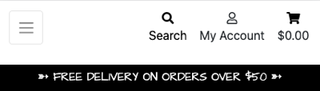

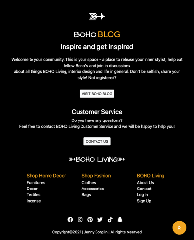

**Home**

The home page features three sections, apart from the header and the footer.

* Hero image with CTA (clicking "Shop now" redirects visitor immediately to the product page) and text.
* Intro text about B.L.
* Carousel with inspiring images of products that links to the actual product category.

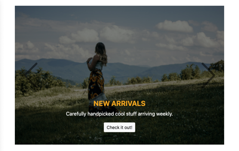

**Products**

* Product section presents the category visiting at the time at the top of the page (except when choosing "All products"), and the number of items in this particular category and a by select box below. The products are presented in rows (1-4 rows depending on the device) including product name, price, category and rating.
* Product details displays a detailed view of the product with product name, price, category, rating, description, quantity input field and "Keep shopping" and "Add to bag" button all in one column.  

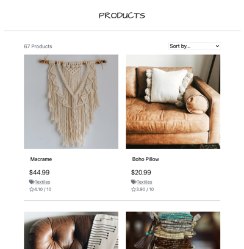

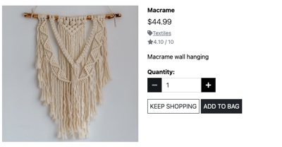

**Home Decor**

* Home Decor section consists of following categories: "New in", "Furnitures", "Decor", "Textiles", "Incense" and "All home decor", which are presented at the top of the page. 

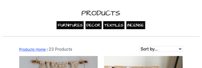

**Fashion**

* Fashion section consists of following categories: "New in", "Clothes", Accessories", "Bags" and "All fashion", which are presented at the top of the page. 

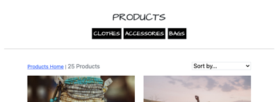

**Outlet**

* Outlet page contains products with discounted prices, category is presented at the top of the page. 

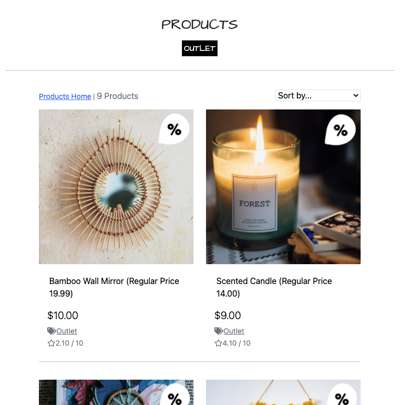

**Boho Blog**

* Boho Blog page contains inspiring blog posts added by admin or users. It has an intro text about general boho style at the top and two "Create your blog post" buttons, one above the blog posts and one below. Each blog post has a title, author, date, text, "Read more" button and an image. All blog posts are presented in one column. 

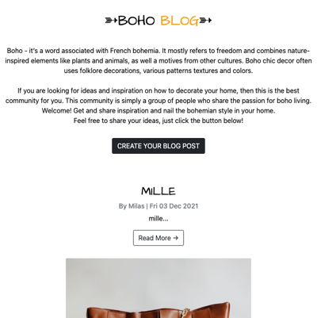

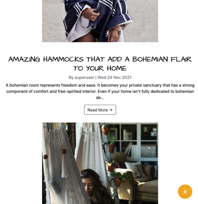

**About us**

* About us page contains short background information about B.L at the top and a contact form below. When filling out the form and submit it, an alert shows in the middle of the screen; "Your message has been sent". User also gets an email that confirms that B.L has received the question.

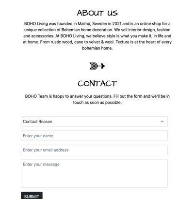

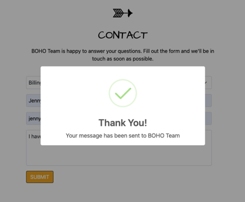

**My account**

If not signed in:
* Sign up - allows visitor to sign up. If user already has an account there is also a link to log in instead. When signing up a toast whit success message is shown and a confirmation mail is sent.
* Sign in - allows registered users to log in. When signed in, a welcome toast is shown.

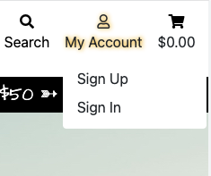

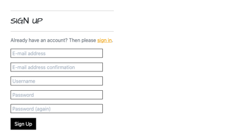

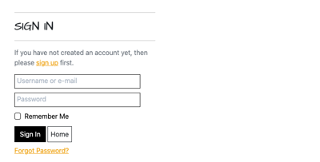

If signed in:
* My Profile - if saved, users delivery information is shown, with the possibility to update the information. If user has an order history it is shown here. 
* Logout - a confirmation text "Are you sure you want to signout?" and a sign out button. 

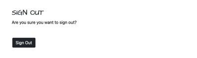

If signed in as a superuser:
* Product management - when signed in a product management link is shown in "My Account" dropdown where you can add products by choosing category, SKU, name, description, size, prize, rating, image url.

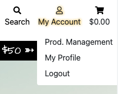

**Shopping cart**

* When shopping cart is empty, an "Your bag is empty" message displays at a new page, along with a "Let's shop" button below the message. 

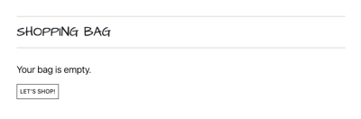

* When shopping cart has items, the shopping bag page is displayed along with the products that are added in bag (including product info, prize, quantity, subtotal, product image, product name, size, update, remove, bag total, delivery cost, grand total, message of how much more to spend to get free delivery, "Keep shopping" and "Checkout" button). "Keep shopping" button links to "All products" page. "Checkout" button links to checkout page. 

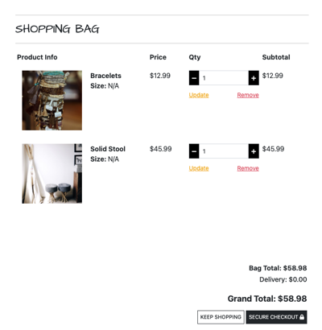

**Checkout**

* Checkout page contains of two sections, one column with a form including details, delivery and payment details, "Adjust bag" and "Complete order" button. The other section (second column) consists of an order summary. When completing the order, a success toast is shown in upper right corner and user get redirected to "Thank you for choosing BOHO Living" page that includes order information, a "Check out the latest deals" that links to "New in products". A confirmation mail is sent to user. 

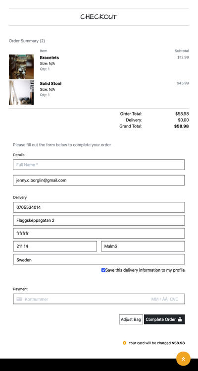

**Toasts**

Four different kind of toasts appears when a certain action has been triggered by user to get feedback on the action (For example adding something in bag, logging in etc.); "Success", "Info", "Warning", "Error".

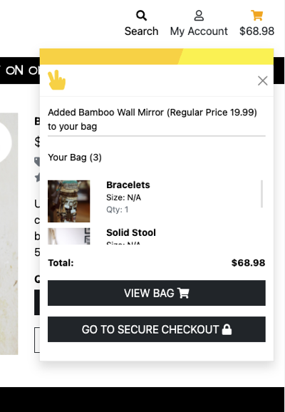

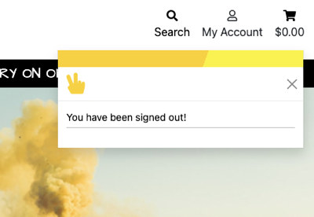

**Django-allauth**

* A Python package used to the sign up, login, logout, password change features. 

**Emailjs**
* Used to send confirmation mail after user filled out the contact form and success message when submitting the form.  

 

## Features left to implement

* Comments and ability to share blog posts to social media (potential to convert more readers into paying customers). 
* Elaborate the SKU numbers, to make even more logical to Administrator.
* Allow the contact form confirmation mail (in About Us page) to send to the actual person that filled the form out (and not to me as it does to day). 
* Social media login.
* More categories. 
* Function to make users giving rating. To day set by Admin based on sales.  
* Email notification functionality for users to be alerted when a new product or service is added.
* User profile picture functionality, allowing users to add profile pictures. Nice feature if posting blog posts. 
* Allowing users to comment the products.
* Easier to get contacted by business partners regarding any collaboration, business deals and sponsorship if site has an more expanded contact/business information. 
* Get more contact information about the registered users (by expanding the details in "My Account" to be able to reach out (newsletters, offers etc).
* Expand blog section to have different categories, ideas, what products are on sale, new in etc.  
* Customize site based on Google Analytics statistic(and other sources). Who are the visitors and customers? What pages and products are popular and not and adjust sortiment/site according to that information to increases the ROI (return on investment). 

## Security features

* If user accendentally or intentionally closes the browser window after the payment is confirmed but before the form is submitted, there would be a payment in Stripe, but no order in the database. To prevent this situation; Each time an event occurs on Stripe (such as a payment intent being created) a payment being completed on Stripe a webhook is sent out that we can listen for. Webhooks are like the signals django sends each time a model is saved or deleted. Except that they are sent securely from Stripe to a url we specify. *(from Boutique Ado project, Stripe, part 10)*

* To ensure that the website is secure, code has @login_required decorators in msp4 app, that makes Django check whether the user is logged in before executing the view. If not logged in user get redirected to sign in page. I also use this decorator for the Profile view, since only logged in users should be able to access. If somebody somehow found out the URL for the edit and delete product management, they could possibly delete all products, thats why the decorators are needed. Only superuser are able to edit and delete, just as it should be. 

## Wireframes 

* [Mobile](https://github.com/jennymalmoe/MSP4/tree/main/wireframes/mobile) 
* [Tablet](https://github.com/jennymalmoe/MSP4/tree/main/wireframes/tablet)
* [Desktop](https://github.com/jennymalmoe/MSP4/tree/main/wireframes/desktop)

**Post wireframes design changes:**
While the project relied on these wireframes, there are some differences between the wireframes and the final product; 

* No spinner icon and background image triggered while Stripe payment is processing.
* An "About Us" page with a contact form was added. 

## Site on different devices

1. iPhone eXpensive portrait · width: 375px
2. iPhone 6-8 portrait · width: 375px
3. iPhone 6-8 Plump portrait · width: 414px
4. Android (Pixel 2) portrait · width: 412px

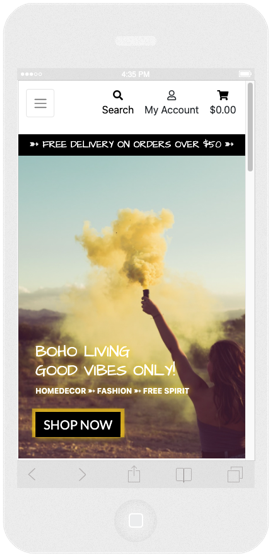
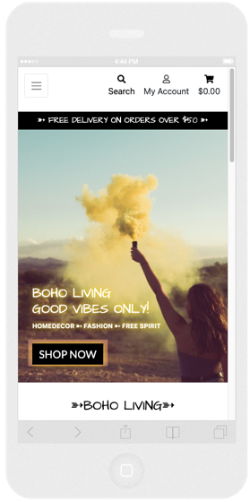

 
 

1. iPad portrait · width: 768px
2. iPad landscape · width: 1024px

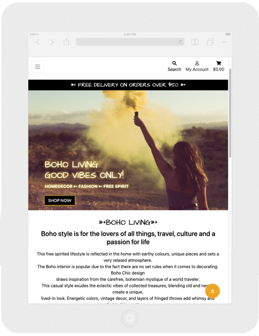
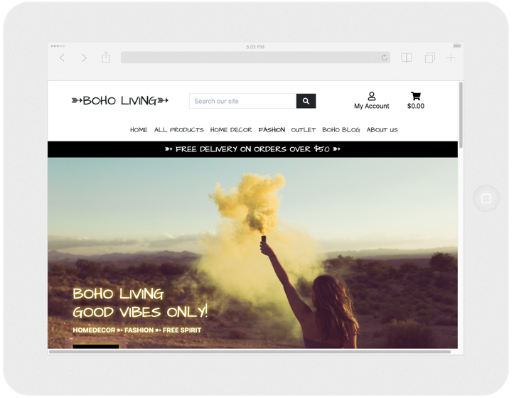

 

1. iPad Pro · width: 1024px height: 1366px 
2. iPad Pro Landscape · width: 1366px height: 1024px

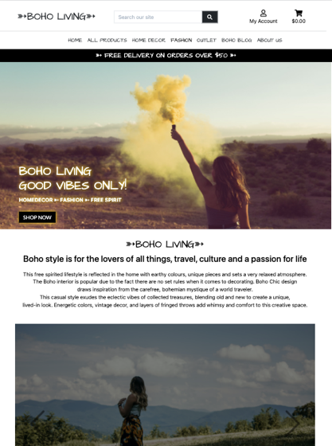
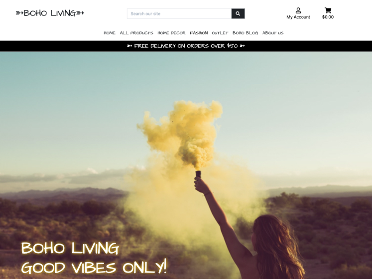

 

1. Galaxy S5 · width: 360px height: 640px
2. Surface Duo · width: 540px height: 720px

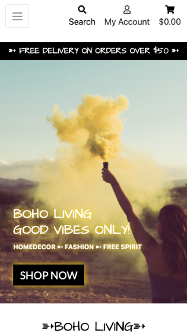
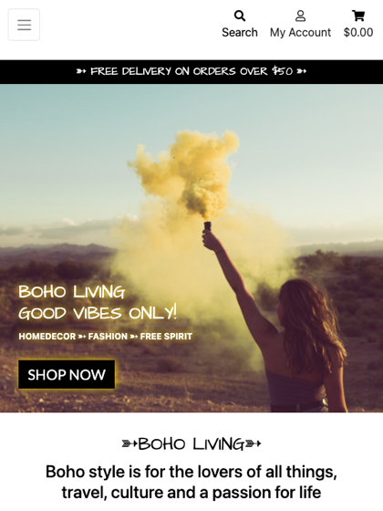

[Back to top](#boho-living)

 

# Database Design

## Site Map

Initial site map shown below:

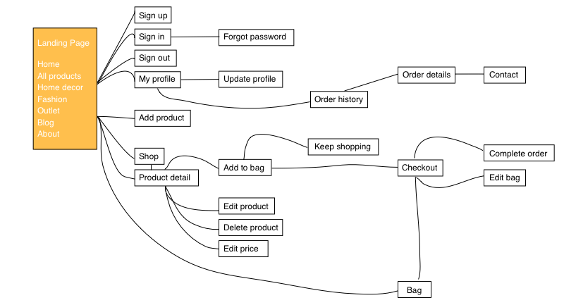

 

This database uses a SQL database through PostgreSQL. Initially the databases were built in JSON files, [link here!](products/fixtures)

* Categories Database
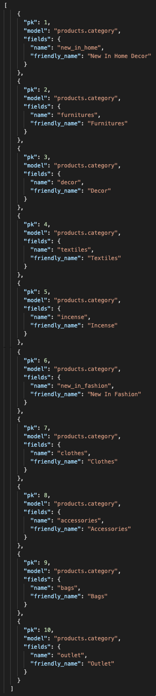

* Products Database

## Information Architecture
Heroku PostgreSQL is used to host the backend database for this site. B.L contains of these Django apps:

* About
* Bag
* Blog
* Checkout
* Home
* Products
* Profiles

## Database schema
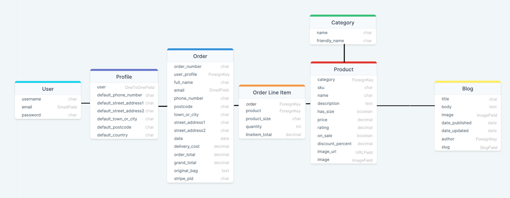

## Database Model

During development the project used SQLite. The deployed app is using Heroku Postgres.

Full list of data models used: 

### Profile App

 

**Profile model**

|Name             |Database Key            |Field Type         | Validation Requirements                     |
|-----------------|------------------------|-------------------|---------------------------------------------|
|User             |user                    |OneToOneField(User)|on_delete=models.CASCADE                     |
|Phone Number     |default_phone_number    |CharField          |max_length=20, null=True, blank=True         |
|Street Address 1 |default_street_address1 |CharField          |max_length=80, null=True, blank=True         |
|Street Address 2 |default_street_address2 |CharField          |max_length=80, null=True, blank=True         |
|Town or City     |default_town_or_city    |CharField          |max_length=40, null=True, blank=True         |
|Postcode         |default_postcode        |CharField          |max_length=20, null=True, blank=True         |
|Country          |default_country         |CountryField       |blank_label='Country', null=True, blank=True |

 

### Products App

 

**Category Model**

| Name             | Database Key            | Field Type              | Validation Requirements                               |
|------------------|-------------------------|-------------------------|-------------------------------------------------------|
| Name             | name                    | CharField               | max_length=250                                        |
| Friendly Name    | friendly_name           | CharField               | max_length=250, null=True, blank=True                 |

 

**Product Model**

| Name             | Database Key            | Field Type              | Validation Requirements                               |
|------------------|-------------------------|-------------------------|-------------------------------------------------------|
| Category         | category                | ForeignKey              | null=True, blank=True, on_delete=models.SET_NULL      |
| Sku              | sku                     | CharField               | max_length=250, null=True, blank=True                 |
| Name             | name                    | CharField               | max_length=250                                        |    
| Description      | description             | TextField               | None                                                  |
| Has sizes        | has_size                | BooleanField            | default=False, null=True, blank=True                  |        
| Price            | price                   | DecimalField            | max_digits=6, decimal_places=2                        |
| Rating           | rating                  | DecimalField            | max_digits=6, decimal_places=2, null=True, blank=True |    
| On Sale          | on_sale                 | BooleanField            | default=False, blank=True                             |
| Discount Percent | discount_percent        | DecimalField            | max_digits=2, decimal_places=0, blank=True, null=True |
| Image Url        | image_url               | URLField                | max_length=1025, null=True, blank=True                |
| Image            | image                   | ImageField              | null=True, blank=True                                 |

 

### Checkout App

 

**Order Model**

| Name                     | Database Key    | Field Type                 | Validation                                                   |
| ------------------------ | --------------- | ---------------------------| -------------------------------------------------------------|
| Order Number             | order_number    | CharField                  | max_length=32, null=False, editable=False                    |
| User Profile             | user_profile    | ForeignKey(UserProfile)    | on_delete=models.SET_NULL, blank=True,null=True, related_name='orders'  |
| Full Name                | full_name       | CharField                  | max_length=50, null=False, blank=False                       |
| Email.                   | email           | EmailField                 | max_length=254, null=False, blank=False                      |
| Phone Number             | phone_number    | CharField                  | max_length=20, null=False, blank=False                       |
| Country                  | country         | CountryField               | blank_label='Country *', null=False, blank=False             |
| Postcode                 | postcode        | CharField                  | max_length=20, null=True, blank=True                         |
| Town or City             | town_or_city    | CharField                  | max_length=40, null=False, blank=False                       |
| Street Address 1         | street_address1 | CharField                  | max_length=80, null=False, blank=False                       |
| Street Address 2         | street_address2 | CharField                  | max_length=80, null=True, blank=True                         |
| Date                     | date            | DateTimeField              | auto_now_add=True                                            |
| Delivery Cost            | delivery_cost   | DecimalField               | max_digits=6, decimal_places=2, null=False, default=0        |
| Order Total              | order_total     | DecimalField               | max_digits=10, decimal_places=2, null=False, default=0       |
| Grand Total              | grand_total     | DecimalField               | max_digits=10, decimal_places=2, null=False, default=0       |
| Original Bag             | original_bag    | TextField                  | null=False, blank=False, default=''                          |
| Stripe Payment Intent ID | stripe_pid      | CharField                  | max_length=254, null=False, blank=False, default=''          |

 

**Order Line Item Model**

| Name            | Database Key   | Field Type          | Validation                                                                   |
| --------------- | -------------- | --------------------| -----------------------------------------------------------------------------|
| Order           | order          | ForeignKey(Order)   | null=False, blank=False, on_delete=models.CASCADE, related_name='lineitems'  |
| Product         | product        | ForeignKey(Product) | null=False, blank=False, on_delete=models.CASCADE                            |
| Product Size    | product_size   | CharField           | max_length=2, null=True, blank=True                                          |
| Quantity        | quantity       | IntegerField        | null=False, blank=False, default=0                                           |
| Line Item Total | lineitem_total | DecimalField        | max_digits=6, decimal_places=2, null=False, blank=False, editable=False      |

 

## Blog App

 

### Blog Model

| Name            | Database Key   | Field Type          | Validation                                                                   |
| --------------- | -------------- | --------------------| -----------------------------------------------------------------------------|
| Title           | title          | CharField           | max_length=150, null=False, blank=False                                      | 
| Body            | body           | TextField           | max_length=5000, null=False, blank=False                                     |
| Image           | image          | ImageField          | upload_to='blogimages', null=True, blank=True                                |
| Date Published  | date_published | DateTimeField       | auto_now_add=True, verbose_name="date published"                             |
| Date Updated    | date_updated   | DateTimeField       | auto_now=True, verbose_name="date updated"                                   |
| Author          | author         | ForeignKey          | User, on_delete=models.CASCADE                                               | 
| Slug            | slug           | SlugField           | max_length=150, blank=True, unique=True                                      |
| | |

 

[Back to top](#boho-living)

# Technologies Used

 

## IDE - Integrated Development Environment
* [GitHub](https://github.com/) - Used to store the projects code after being pushed from Git. 

## Languages
* [HTML](https://developer.mozilla.org/en-US/docs/Web/HTML) - Used to create the site structure.
* [CSS](https://developer.mozilla.org/en-US/docs/Web/CSS) - Used to create the styling throughout the site.
* [JavaScript](https://developer.mozilla.org/en-US/docs/Web/JavaScript) - Used for the sidenav, back-to-top button, image preview.
* [Python](https://www.python.org/) - Used to write the logic that operates the site.

## Database 
* [SQLite](https://www.sqlite.org/index.html) - Database used during development.
* [Heroku Postgres](https://www.heroku.com/home) - Database used for production/deployed app. 

## Storage 
* [Amazon AWS S3](https://aws.amazon.com/?aws-products-compute.sort-by=item.additionalFields.productNameLowercase&aws-products-compute.sort-order=asc&aws-products-iot.sort-by=item.additionalFields.productNameLowercase&aws-products-iot.sort-order=asc&aws-products-security.sort-by=item.additionalFields.productNameLowercase&aws-products-security.sort-order=asc) - The Amazon Web Service s3 Bucket was used to store media and static files.

## Payment 
* [Stripe](https://stripe.com/) - Payment platform. 

## Frameworks 
* [Bootstrap](https://getbootstrap.com/) - Bootstrap 5.1 used to design and build responsive, mobile-first sites.
* [Django](https://www.djangoproject.com/) - Web development framework.

## Libraries, Tools, Editors 

* [Am I Responsive](http://ami.responsivedesign.is/) - Used to validate the responsiveness. 
* [Balsamiq](https://balsamiq.com/) - Used to create wireframes.
* [Bulma](https://bulma.io/) - Used for icon class.
* [Chrome DevTools](https://developer.chrome.com/docs/devtools/)  - Used Lighthouse to check sites performance and dev tool to check responsiveness.
* [Dj-database-url](https://pypi.org/project/dj-database-url/) - A utility to help you load your database into your dictionary from the DATABASE_URL environment variable.
* [Django Allauth](https://django-allauth.readthedocs.io/en/latest/) - Used to create the user sign-in function for the site.
* [Django Countries](https://pypi.org/project/django-countries/) - Used for the country select field in the order form.
* [Django Crispy Forms](https://django-crispy-forms.readthedocs.io/en/latest/) - Used to utilise the Bootstrap form classes.
* [drawSQL](https://drawsql.app/) - Used to create database diagram.
* [Font-Awesome](https://fontawesome.com/) - Used for icons.
* [Git](https://git-scm.com/) - Used for version control to commit to Git and push to Heroku.
* [Gitpod](https://gitpod.io/) - Open-source application for ready-to-code developer environments in browser.
* [Google fonts](https://fonts.google.com/) - Used to import fonts.
* [Gunicorn](https://gunicorn.org/) - Used for deploying the project to Heroku.
* [Imgur](https://imgur.com/) - Used to create url:s for images.
* [Jinja](https://jinja.palletsprojects.com/en/2.10.x/) - Jinja templating language was used to simplify and display backend data in html.
* [JSHint](https://jshint.com/) - JavaScript code quality tool, used to detect errors.
* [JQuery](https://jquery.com/) - Used for DOM traversal, HTML manipulation, and event handling.
* [Unsplash](https://unsplash.com/) - Images used throughout the site.
* [PEP8](https://www.python.org/dev/peps/pep-0008/) - Used to improve the readability and consistency of Python code.
* [PEP8online](http://pep8online.com/) - Used to check code for PEP8 requirements.
* [Pillow](https://pillow.readthedocs.io/en/stable/) - Python Imaging Library.
* [pip](https://pip.pypa.io/en/stable/) - Used to install packages from the Python Package Index.
* [Pixelmator](https://www.pixelmator.com/mac/) - Used to resize images, creating logo and tab icon.
* [Responsinator](https://www.responsinator.com/) - Used for the responsive screenshoots on different device resolutions. 
* [Responsive Test Tool](http://responsivetesttool.com/) - Used for the responsive screenshoots on different device resolutions. 
* [Postimages](https://postimages.org/) - Used to create url for images. 
* [SweetAlert2](https://sweetalert2.github.io/) - Used to customise the contact form success message
* [TechSini](https://techsini.com/) - Mockup generator used for preview of the website.
* [Visual Studio Code](https://code.visualstudio.com/) - IDE used for code editing.
* [W3C Validator](https://validator.w3.org/) - Used to test HTML code.
* [W3C Validator CSS](https://validator.w3.org/) - Used to test CSS code.

## Packages/Dependencies

| Name | Purpose |
|------|---------|
| asgiref | Allows web apps and servers to communicate |
| Boto3 | AWS Management |
| Botocore | AWS Management |
| crispy-bootstrap5 | Bootstrap5 template pack for django-crispy-forms |
| dj-database-url | Database Configuration |
| Django | Framework |
| django-allauth | Authentication |
| django-countries | Country Form Field |
| django-crispy-forms | Front End Form Rendering |
| django-storages | Custom Storage Backends |
| gunicorn | WSGI HTTP Server |
| jmespath | Data driven testcases |
| oauthlib | Framework |
| Pillow | Images |
| psycopg2-binary | PostgreSQL DB Adaptor |
| python3-openid | Python packages |
| pytz | Library |
| requests-oauthlib | Authentication support for Requests |
| s3transfer | Python library for managing Amazon S3 transfers |
| sqlparse | Non-validating SQL parser for Python |
| Stripe | Secure Payment Services |
| | |

 

[Back to top](#boho-living)

# Testing

Testing section is located here [testing.md file](/testing.md)

[Back to top](#boho-living)

# Deployment

This project has been developed using Gitpod and GitHub. The project was regularly committed to GitHub during the initial development phase.
The website was stored as a repository in GitHub, and has later been deployed using Heroku. Static files are stored using Amazon AWS in an Amazon Web Services S3 Bucket.

Requirements to deploy:

* An IDE (Such as GitPod or VSCode)
* Git for version control 
* GitHub account
* Heroku account
* AWS S3 account
* Stripe account
* Email account
* Python3 
* pip for Python package installation

 

## Forking the GitHub Repository
Making a copy of the original repository on our GitHub account to view or to make changes without affecting the original repository, follow the steps below;

1. Log into [GitHub](https://github.com/) and locate the repository.
2. Click on `Fork` on the top right of the page.

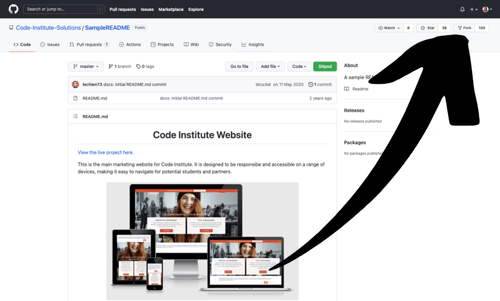

3. You should now have a copy of the original repository in your GitHub account.

 

## Making a Local Clone

1. Log in to [www.github.com](https://github.com/)) with your GitHub account.
2. Click the profile dropdown in the upper right corner.

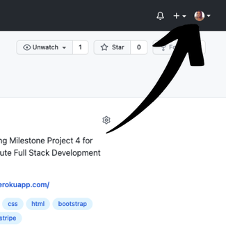

3. Choose `Your repositories`

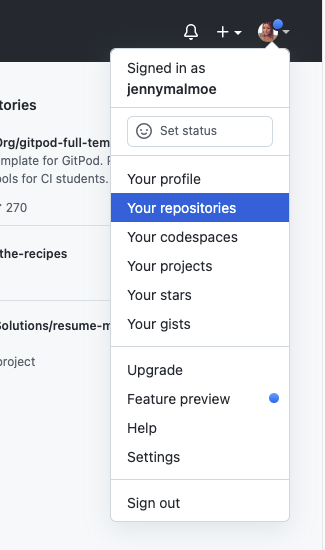

4. Navigate to the relevant [repository](https://github.com/jennymalmoe/MSP4) in the main page of the repositories.

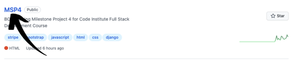

5. Click the `Code` button.

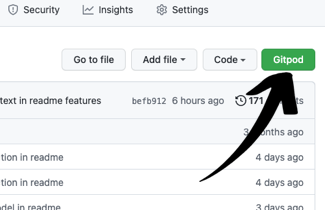

6. To clone the repository using HTTPS, under `Clone with HTTPS`, click the icon marked in the screenshot. To clone the repository using an SSH key, including a certificate issued by your organization's SSH certificate authority, click Use SSH, then click the icon marked in the screenshot. To clone a repository using GitHub CLI, click Use GitHub CLI, then click the icon marked in the screenshot.

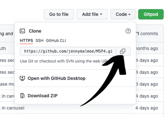

7. Open terminal.
8. Change the current working directory to the location where you want the cloned directory.
9. Type **git clone**, and then paste the URL you copied earlier.

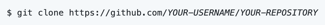

10. Press `Enter` to create your local clone.

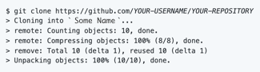

 

## Download the project

1. Go to [Project Code Repository Location](https://github.com/jennymalmoe/MSP4) on Github. 
2. Select the Code dropdown and choose the Download ZIP option.

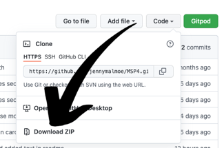

3. This will download a copy of the entire project locally as a zip file.
4. Any required Python dependencies should be installed locally using the terminal command $ pip install -r requirements.txt.

## Set up local testing environment

To set up the local testing environment once the code has been Cloned or Forked, the following environment variables should be added to the Gitpod environment variables.
Gitpod environment variables can be accessed from the top right of the Gitpod home screen, by clicking on the User icon and selecting Settings, then Variables from the left hand menu.

Variable|Value|
--------|-----|
DEVELOPMENT|True|
SECRET_KEY|`your_django_secret_key`
STRIPE_PUBLIC_KEY|`your_stripe_public_key`
STRIPE_SECRET_KEY|`your_stripe_secret_key`
STRIPE_WH_SECRET|`your_stripe_webhook_secret_key`

## Deploy website to Heroku

1. Create an account at [Heroku](https://id.heroku.com/login).
2. Choose a name for your application, select the region closest to your, and then click `Create app`.

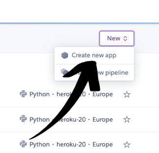

4. After you created your app click on Resources tab, using the `Add ons` search field find, and select `Heroku Postgres`.
5. Select your plan and click confirm.
6. In order to use Heroku Postgres you need to install two dependencies `dj_database_url` and `psycopg2-binary`

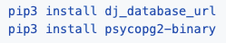

7. After installing the dependencies, freeze your requirements into `requirements.txt`

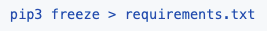

8. In your settings.py file import `dj_database_url` and replace your current Database settings to:
    Your `DATABASE_URL` can be found in your Heroku Apps `Config Var`

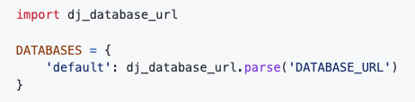

9. After setting your Database, run the following commands to migrate models:

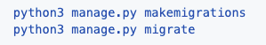

10. Load the data to the database from the db.json file by running following command:

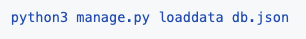

11. Create a superuser for your app 

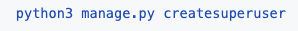

12. Heroku setup is complete, now add an if statement in your settings.py file to set the DATABASES:

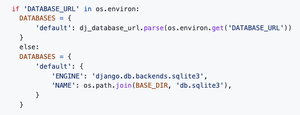

13. Install `gunicorn` and freeze your requirements

14. Create a `Procfile` and add the following code in your `Procfile`

15. Connect to Heroku fom the terminal:

16. Go to back to the Settings tab on your Heroku dashboard, and click "Reveal Config Vars" and add the following Config Variable, to temporarily disable `COLLECTSTATIC`:

17. In your settings.py file add your Heroku app, and `localhost`

18. In your Heroku app dashboard, click on `Settings` tab on your Heroku dashboard, and click `Reveal Config Vars` and add the following Config Variables:

    |Key|Value|
    |---|----|
    |SECRET_KEY|YOUR_SECRET_KEY|
    |STRIPE_PUBLIC_KEY|YOUR_STRIPE_PUBLIC_KEY|
    |STRIPE_SECRET_KEY|YOUR_STRIPE_SECRET_KEY|
    |STRIPE_WH_SECRET|YOUR_STRIPE_WH_SECRET|
    |EMAIL_HOST_USER|YOUR_EMAIL_ADDRESS|
    |EMAIL_HOST_PASS|YOUR_EMAIL_APP_PASSWORD|

19. Then push to Heroku:

20. Navigate to `Deploy` tab on your Heroku apps Dashboard, and click on `Enable Automatic Deploys`.
21. Site is successfully deployed, and any futher changes on the app will automatically be updated everytime they are commited and pushed on Github.

## AWS 

The deployed version of this website has static and media files hosted to it via the web based service; Amazon Web Services S3 Bucket.

1. Create or login to your AWS account at [aws.amazon.com](https://aws.amazon.com/?aws-products-analytics.sort-by=item.additionalFields.productNameLowercase&aws-products-analytics.sort-order=asc&aws-products-business-apps.sort-by=item.additionalFields.productNameLowercase&aws-products-business-apps.sort-order=asc&aws-products-containers.sort-by=item.additionalFields.productNameLowercase&aws-products-containers.sort-order=asc&aws-products-compute.sort-by=item.additionalFields.productNameLowercase&aws-products-compute.sort-order=asc&aws-products-databases.sort-by=item.additionalFields.productNameLowercase&aws-products-databases.sort-order=asc&aws-products-fe-mobile.sort-by=item.additionalFields.productNameLowercase&aws-products-fe-mobile.sort-order=asc&aws-products-game-tech.sort-by=item.additionalFields.productNameLowercase&aws-products-game-tech.sort-order=asc&aws-products-iot.sort-by=item.additionalFields.productNameLowercase&aws-products-iot.sort-order=asc&aws-products-ml.sort-by=item.additionalFields.productNameLowercase&aws-products-ml.sort-order=asc&aws-products-mgmt-govern.sort-by=item.additionalFields.productNameLowercase&aws-products-mgmt-govern.sort-order=asc&aws-products-migration.sort-by=item.additionalFields.productNameLowercase&aws-products-migration.sort-order=asc&aws-products-network.sort-by=item.additionalFields.productNameLowercase&aws-products-network.sort-order=asc&aws-products-security.sort-by=item.additionalFields.productNameLowercase&aws-products-security.sort-order=asc&aws-products-storage.sort-by=item.additionalFields.productNameLowercase&aws-products-storage.sort-order=asc) and click on `Amazon S3`.  
2. Create a new bucket with the following settings:

* An appropriate name (your project name)

* Region (closest to you)

* Uncheck `Block all Public Access`

* Open the new bucket and `Enable Static Website Hosting` (bottom of page)

* In the permissions tab, edit the CORS configuration (near bottom) and use the following code to set up the required connection between the Heroku app and the bucket:

* In the permissions tab, click `Edit` on the Bucket Policy and open the policy generator

* Use the following settings to setup the policy correctly:

  + *Type of Policy: `S3 Bucket Policy`*

  + *Principal: `*` to allow all principles*

  + *Action: `Get Object`*

  + *Amazon Resource Name (ARN): Paste your Bucket ARN and add * at the and of your Bucket Resource key arn:aws:s3:::bucket_name/* and then save*

**IMPORTANT! Add "/*" to the end of the resource key to ensure all files are loaded**

* Click on Access Control List (ACL), and enable `List` on `Everyone (public access)` tab.

* On the top of your AWS Management Console, Search for `IAM` or `Identity Access Management`

  + * Click on `User Groups` on the left panel, and `Create Group`

  + * Click on `Policies` and `Create Policy`

  + * Click on JSON and select `Import Managed Policy` and search for `AmazonS3FullAccess` and click import

  + * Copy your `Bucket ARN` and paste it in the `Resource`

  + * `Click on Review Policy`

* Go back to `User Groups` and click on the group name you just created, click on `Permissions` then `Attach Policies` and search for the policy you've just created and then click on `Attach Policy` to attach the policy to the group

* Click on `Users` and then click on `Add Users`

  + * Set your user's name and give `Programmatic Access`

  + * Click `Next` and add the user in your New Group and `Create User`

  + * After you created the user download user's `.csv` file which contains user's access key and secret access key.

* Go back to your IDE and install the following dependencies in order to connect Django to AWS S3

* Freeze your requirements

* Add it to your installed apps in your settings.py

* Create `custom_storages.py` file in your project root and add the following code, and then save

* In your `settings.py` file add the following code

* Add the following config variables in your Heroku App, and remove `DISABLE_COLLECTSTATIC=1`

|Key|Value|
|---|----|
|USE_AWS|True|
|AWS_ACCESS_KEY_ID|YOUR_AWS_ACCESS_KEY_ID|
|AWS_SECRET_ACCESS_KEY|YOUR_AWS_SECRET_ACCESS_KEY|

* Deployment complete!

 

[Back to top](#boho-living)

# Credits

## Content
* Code Institute tutor support.
* Fellow students on Slack for a helping hand when I've got stuck.
* https://codingwithmitch.com/ for code and inspiration to my blog section. 

## Media
* All images for the project was taken from [Unsplash](https://unsplash.com/).

## Code
* Code Institute for inspiration from the Boutique Ado project.
* https://codingwithmitch.com/ for code and inspiration to my blog section.

So a word of warning about your webhooks still. This all works fine for your local endpoint, but if you're going to use the heroku one it will need a different WH_SECRET_KEY in your Heroku cvars. You can find this by Reveal the signing secret you find for the heroku endpoint in Stripe website. So both local and deployed site have the same STRIPE_PUBLIC_KEY and STRIPE_SECRET_KEY but they will have different STRIPE_WH_SECRET.

 

 

 

