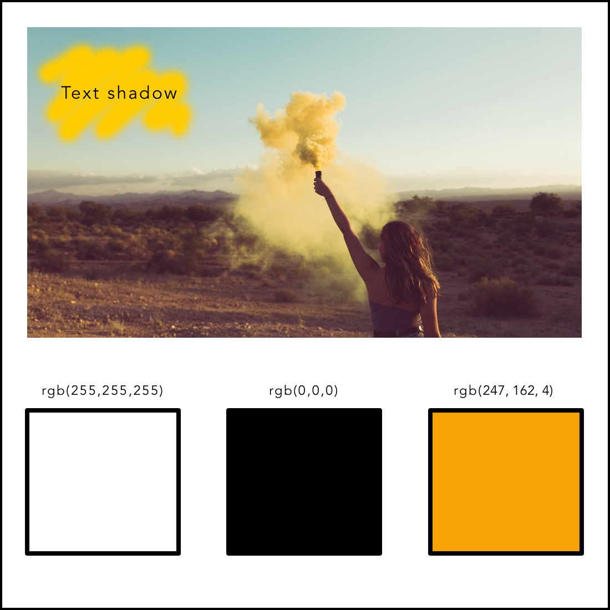

# BOHO Living!

 

[View live website here!](https://msp4.herokuapp.com/)

[View GitHub repository here!](https://github.com/jennymalmoe/MSP4)

 

 

BOHO Living is an online home decor shop that offers a selection of trendy home decor and fashion items inspired by the modern bohemian style.

This is an e-commerce web application for a fictional company. The application features e-commerce functionality, payments using stripe, a blog section, confirmation emails, CRUD functionality for admin to add blog posts and stock items, and an admin section, for the admin user to access database records.

This website is only for educational purposes and the stripe functionality is set up to accept test card details, please don't enter your personal card details.

To use the stripe function use the following details:

Card number: 4242 4242 4242 4242

Date: 4242?

CVV Number:424?

 

## Table of contents

___

## [User Experience](#user-experience)
* [**Project Goals**](#project-goals)
* [**Business Goals**](#business-goals)
* [**User Stories**](#user-stories)
* [**Design Choices**](#design-choices)
    * [Color scheme](#color-scheme)
    * [Typography](#typography)
    * [Imagery](#imagery)
    * [Icons](#icons)
* [**Wireframes**](#wireframes)

## [Features](#features)
* [**Existing Features**](#existing-features)
* [**Features Left to Implement**](#features-left-to-implement)

## [Database Design](#database-design)

## [Technologies Used](#technologies-used)
* [**Languages**](#languages)
* [**Frameworks, Libraries & Programs**](#frameworks,libraries-programs)

## [Testing](#testing)
* [**Testing User Stories from User Experience (UX) Section**](#testing-user-stories-from-user-experience-(UX)-section)
* [**Further Testing**](#further-teseting**)
* [**Known Bugs**](#known-bugs**)

## [Deployment](#deployment)
* [**GitHub Pages**](#github-pages)
* [**Forking the GitHub Repository**](#forking-the-github-repository)
* [**Making a Local Clone**](#making-a-local-clone)

## [Credits](#credits)
* [**Code**](#code)
* [**Content**](#content)
* [**Media**](#media)
* [**Acknowledgements**](#acknowledgements)

 

# User Experience

## Project Goals

 

The purpose of this project is to 

*"...build a full-stack site based around business logic used to control a centrally-owned dataset. You will set up an authentication mechanism and provide paid access to the site's data and/or other activities based on the dataset, such as the purchase of a product/service"* using HTML, CSS, JavaScript, Python+Django, a relational database (recommending MySQL or Postgres), Stripe payments
and possible additional libraries and API's. 

Create a web application that allows users/store owner to:
    
* Add products to the website (CREATE)
* Find products to purchase online (READ)
* Edit products (UPDATE)
* Delete products (DELETE)

## Business Goals

 

This e-commerce website focus on maximizing direct sales to new and returning customers (convert a website visitor into a customer) by simplify and optimize content to be easy to shop (user friendly site). Also establishing brand recognition in the industry.  Target audience?

In addition to the goals above; also blog etc

## User Stories

 

This user story template consists of three sections; As a (decription of user), I want (functionality/goal), So that (benefit). It has short descriptions, requirements (who and why), general guidance, no technical details. 

| ID  | As a..    | I want to..                                                    | So I..                                                                           |
| --- | ---------- | ----------------------------------------------------------------- | ------------------------------------------------------------------------------------- |
|     |            | **_Viewing and Navigation_**                                      |                                                                                       |
| 1   | Shopper    | Be presented with an intutive site navigation that is user friendly and over all ease-of-use                              |  Get a good impression about the site and company
| 2   | Shopper    |    Visit a structured and professional website                       | Understand the main purpose of the site/business  
| 3   | Shopper    | View list of products                                             | Can see what the website has to offer                                                            |
| 4   | Shopper    | View details of the products                                           | Easily can see price, description, image, sizes if any                                          |                                             |
| 5   | Shopper    | See my cart's total at any time                                   | Avoid spending too much                                                               |
| 6   | Shopper    | Be inspired by the site, the products and the design                              |  Find products to buy (both for visitors that searched for products online and got presented to this site as well for those visitors that visited the site by entering sites address) and return to make more purchase. 
| 7   | Shopper    | Be presented to some kind of contact information/social media links                              |  Feeling a sence of crediblity
| 8   | Shopper    | Be able to reach out to siteowner                              |  Get answers to any possible questions
|     |            | **_Registration_**                              |                                                                                       |
| 5   | User   | Register for an account by entering email, password and confirming my password                                         | Can access to Boho Living                                          |
| 5   | User   | Register for an account                                           | Save default delivery information and keep a record of order history, get mails with news and offers                                          |
| 6   | Reg User   | Quickly login/out                                                 | Access my account                                                                     |
| 7   | User   | Request a password reset                                          | Receive an email to reset my password in case I forget it                            |
| 8   | User   | Receive an email confirming my registration                       | Verify my account was registered successfully                                         |
| 9   | User   | Access my user profile                                            | View my order history, manage my personal details                                     |
|     |            | **_Login_**                                  |                                                                                       |
| 25  | Registered User | Login by entering email and password                                            | Can access the application
| 25  | Registered User | Reset my password  
|     |            | **_Logout_**                                  |                                                                                       |
| 25  | Registered User | Be able to logout                                            | Ensure that nobody else are in my account                                          | If I forgot the password
|     |            | **_Sorting and Searching_**                                       |                                                                                       |
| 10  | Shopper    | Sort the list of available products                               | See the products in a list sorted by price, rating etc            |
| 11  | Shopper    | Sort a category of products                                       | See the products in a category sorted by name, price, rating, etc                     |
| 12  | Shopper    | Sort multiple categories simultaneously                           | Find the best rated or best priced across broad categories |
| 13  | Shopper    | Search for product                                                | Find a specific product I wish to purchase                                               |
| 14  | Shopper    | View a list of search results                                     | See if the product I want is available to purchase  
| 15  | Shopper    | View an image and details for each product                                     | So I can decide if I want to add to cart from the detail or search pages or not.                                   |
|     |            | **_Purchasing and Checkout_**                                     |                                                                                       |
| 15  | Shopper    | Easily select the size and quantity whilst purchasing a product     | Ensure I don't accidentally select the wrong product, quantity, or size               |
| 16  | Shopper    | Review my cart                                          | Can make adjustments prior to checkout           |
| 17  | Shopper    | Adjust the quantity of individual items in my bag                 | Easily adjust the amount of an item I intended to purchase (including removing)       |
| 18  | Shopper    | Easily enter my payment information                               | Checkout quickly and easily                                                      |
| 19  | Shopper    | Feel my payment and personal information is secure                | Provide the needed payment and personal information, and feel it is handled safely    |
| 20  | Shopper    | View confirmation of order before completing purchase             | Verify I haven't made any mistakes                                                    |
| 21  | Shopper    | Receive confirmation email after checking out                     | To keep record of the purchase
| 22  | Shopper    | The store to have some kind of custom service                     | Can get in touch if I have questions, if something is wrong.                                                   |
|     |            | **_Admin and Store Management_**                                  |                                                                                       |
| 22  | Administrator | Modify the list of products                                                     | Can adjust our offerings over time                                                       |
|     |            | **_Site manager_**                                  |                                                                                       |
| 25  | Shopper | Be able to manage/edit the site                                            | Keep the site relevant and with correct information/sortiment                                        |
|     |            | **_Community_**                                  |                                                                                       |
| 26  | Shopper | Get inspired and get ideas                                            | Buy items that matches my idea of home decoration                                                          |
| 27  | Shopper | Be able to contibute with my own ideas by adding a post                                             | Be/feel like a part of the community and contrbute with inspiration and ideas                               |
                                             |

* First Time Visitor Goals

    * As a first time visitor, I want to easily understand the main purpose of the site. What kind of products, prizes etc.
    * As a first time visitor, I want the site navigation to be intutive, user friendly and over all ease-of-use.
    * As a first time visitor, I want to be inspired and interested of buying products.
    * As a first time visitor, I want to feel it is safe to purchase products from the site. 
    * As a first time visitor, I want to locate some sort of contact information or social media links to be able to follow and get a feel for the credibility of the site. 

 

* Returning Visitor/Customer Goals

    * As a returning visitor, I want to be able to use my previously added information (such as address etc) when purchase a product.  
   
 

* Frequent Visitor Goals

    * As a frequent visitor, I want to get presented with new products and seasonal products.

 

## Design Choices

 

* Color scheme
    
    The page consists of a white base with black, orange and yellow as accent colors. The combination of black and white offers the maximum contrast possible, as they come from opposite ends of the color spectrum. Black and white websites are classical, strong, and powerful. Apart from black and white being a risk-free combination and ensuring a design will look clean, removing color forces a designer to rely on other elements in their web designs such as typography, layout, or grid to catch the viewers' attention. Boho style/the products has asymmetrical layouts, variegated patterns and handcrafted textures. Placed in a clean, contemporary space, layers of colorful textiles deliver an unexpected twist. Thats what I had in mind chosing colors and style for this website.  
    
    Orange is an attention-grabbing color that tends to stand out visually as an accent standing out against neutral colors. The color orange is often associated with spiritual practices including meditation and compassion, as well as warmth, creativity and emotions. Orange has very high visibility, you can use it to draw attention and highlight the most important elements of your design. I used it as a compliment to the crisp and clean white and black colors. 

    I've used yellow text shadows in a few different places at the site. This bright yellow is an attention-getter, and its contrast with black is the most visible color combination. 

    All buttons are either black, white or orange. 
    
    

* Typography

    Lato is an open source, sans-serif font. Lato font is the main font used throughout the site with Major Mono Display used to headers. The font is created to give the letterforms familiar harmony and elegance. The semi-rounded details of the letters give Lato a feeling of warmth, while the strong structure provides stability and seriousness. Lato is used in the body content for the site to appear to be approachable which is the main goal for this website. 
    
    Architects Daughter font incorporates the graphic, squared look of architectural writing, combined with the natural feel of daily handwriting. It is clean but unconventional and gives the site a relaxed vibe. The combination of these two fonts represents both the webshop/business side aswell as the relaxed boho approach. 

    

* Imagery

    Images and the choices of the images is an important component of this site. The hero image on the landing page gives the site a dramatic appearance and sets the tone for the boho inspired page. I use lot of space around images and content to get the visitor an uncluttered and comfortable browsing experience on all device sizes. The product images for the e-commerce part of the site is chosen to be more artistic than detailed to fit the boho-tone. The appearance is aiming to be appealing to the target audience. 

* Icons

    All icons (except the one at the tab which is taken from FreeIcons) used are taken from Font Awsome. The use of icons in web design is a proven method to modernize a website and help direct user flow. Adding icons to the site's content helps a user better process the information and provides a visual focus point that grounds a user to a specific section. I used icons to improve visual interest and grab the user's attention.

 

## Wireframes 

* [Mobile](https://github.com/jennymalmoe/MSP3/blob/main/wireframes/mobile/wireframes_mobile.pdf) 
* [Tablet](https://github.com/jennymalmoe/MSP3/blob/main/wireframes/tablet/wireframes_tablet.pdf)
* [Desktop](https://github.com/jennymalmoe/MSP3/blob/main/wireframes/desktop/wireframes_desktop.pdf)

 

**Post wireframes design changes:**
While the project relied on these wireframes, there are some differences between the wireframes and the final product. 

* Only register button at Home page and no Log In button.
* I choose to only have one social media channel in footer.
* There is no qoute at the bottom of Home page.
* There are no category buttons at Recipe page.
* Recipe cards at Recipe page has a little bit of different styling than in wireframes. 
* No user information in Profile page. 
* Slightly different layout of the recipes after you clicked to view recipe.

 

# Features

## Existing Features 

 

Every page of the website features a consistently responsive and intuitive layout and navigational system:

**General features**
* Responsive site on all devices.
* Fixed navbar to be seen at all times. 
* Navigation bar works as intended. When you click on the site name, you will be taken directly to the home page. When you press the home button from the drop-down menu, you'll be taken to the home page. The site has four categories, all products, clothing, household items and specials listed in the Large Appliances Center and a drop-down menu for medium and small appliances. In the upper right corner there is a login that takes the user to the page where he can log in or register.
* Footer on all pages.
* Shown as a collapsible navbar (hamburger button) triggered at tablets and mobile devices. 
* Search bar allowing visitors to search for products. 
* Visitor can contact BOHO Living by clicking at mail address in footer.
* Visitor can follow BOHO Living at Pinterest by clicking Pinterest icon.

**Home Page**
* Features a modern design and eye catching image.
* Visitor/Users can get redirected directly to Recipe page. 
* Registration, visitors allows to register.

**Recipe Page**
* Visitors/Users can search for recipes.
* Features a clean search bar for user to search. 
* Visitors/Users can read recipes.
* Visitors/Users can see who added the recipes.

**Shop Page**
* Kitchen ware is presented and visitor can get inspired by the products and get redirected to the site and buy the products.
* Features some examples of products that goes hand in hand with the rest of the sites purpose; eco and vegan friendly kitchen ware.

**Log In Page**
* Log In is possible after registered.
* User gets a success message when loged in to verify user stated right username and password.
* Features a clean log in form for user to log in.
* Users can be redirected directly to Registration Page if not already registered.
* Users can contact Lazy Vegan (mail).
* User get redirected to Profile Page after login in.

**Log Out**
* User get redirected to Log In Page after login in.
* User gets a success message when loged out to verify user loged out.
* Features a clean log out form for user to log out.

**Register Page**
* Registration, visiters allows to register.
* User gets a "welcome message" at Profile page when registered to verify user registration. 
* Features a clean registration form for visitor to sign up.
* Visitor can be redirected directly to Log In Page if already registered.
* Visitor can contact Lazy Vegan (mail).
* User get redirected to Profile Page after registered.

**Profile Page**
* Users can see own added recipes. 
* If user hasn't added any recipes, a suggestion to do that is presented along with a button to redirect directly to Add Recipe page. 
* Users can edit, delete and add recipes. 

**Add Recipes**
* User can choose between four categories, add a recipe name, image url, choose to use default image insted of own image, see a preview of that image url, add ingredients and directions for the recipe, tell if it is a gluten free recipe or not.
* User gets a success message when added a recipe to verify adding recipe completed.
* Features a clean form for user to add a recipe.
* Done adding recipe get redirected to Recipe Page.

**Edit Recipe**
* Edit one or more sections in the recipe (only recipes added by user her self).
* User gets a success message when edited a recipe to verify updated recipe completed.
* Delete a recipe (only recipes added by user her self).
* Features a clean form for user to edit, delete or cancel.
* Each section is pre-filled with data provided when adding recipe in first place. 
* Done editing recipe get redirected to Recipe Page.

**Delete Recipe**
* User gets a success message when deleting a recipe to verify recipe now deleted. 

 

## Features left to implement
* Email notification functionality for users to be alerted when a new recipe is added.
* Be able to search through categories, kind of food (italian, mexican etc).
* Ability to reset an account password.
* User profile picture functionality, allowing users to add profile pictures.
* Allowing/Enabling users to comment the recipes.
* Present more information about the benefits for being a vegan and living a vegan lifestyle.
* Easier to get contacted by business partners regarding any collaboration, business deals and sponsorship.
* Get more contact information about the registered users to be able to reach out (newsletters, offers etc).
* Some kind of chatt/forum for the community to grow. 

 

# Database Design

 

MongoDB Atlas is used as database backend for storing user and recipes details. There are three collections; 

 

## Database schema

 

# Technologies Used

 

**Languages, Frameworks and Libraries**

 

* [Bootstrap](https://getbootstrap.com/) - Bootstrap 5.1 used to design and build responsive, mobile-first sites. 
* [CSS](https://developer.mozilla.org/en-US/docs/Web/CSS) - used to create the styling throughout the site.
* [Google fonts](https://fonts.google.com/) - used to import fonts.
* [Django](https://www.djangoproject.com/) - framework used to create this project.
* [Django Allauth](https://django-allauth.readthedocs.io/en/latest/) - used to create the user sign-in function for the site.
* [Django Countries](https://pypi.org/project/django-countries/) - used for the country select field in the order form.
* [Django Crispy Forms](https://django-crispy-forms.readthedocs.io/en/latest/) - used to utilise the bootstrap form classes.
* [HTML](https://developer.mozilla.org/en-US/docs/Web/HTML) - used to create the site structure.
* [JavaScript](https://developer.mozilla.org/en-US/docs/Web/JavaScript) - used for the sidenav, back-to-top button, image preview.
* [Python](https://www.python.org/) - used to write the logic that operates the site.
    
 

**Tools and Editors**

 

* [Am I Responsive](http://ami.responsivedesign.is/) - used to validate the responsiveness. 
* [AWS Amazon Web Services](https://aws.amazon.com/s3/) - Cloud computing platform. S3 (Simple Storage Service) used to store media and static files.
* [Balsamiq](https://balsamiq.com/) - used to create the wireframes.
* [Bulma](https://balsamiq.com/) - an open source CSS framework, used for icon class.
* [Chrome DevTools](https://developer.chrome.com/docs/devtools/)  - used Lighthouse to check sites performance and the dev tool to check responsiveness.
* [Designwizard](https://www.designwizard.com/) - used for inspirations regarding color combinations.
* [Font-Awesome](https://fontawesome.com/) - used for icons.
* [FreeIcons](https://freeicons.io/) - used for icon in tab.
* [Git](https://git-scm.com/) - used for version control to commit to Git and push to Heroku.
* [GitHub](https://github.com/) - used to store the projects code after being pushed from Git.
* [Gitpod](https://gitpod.io/) - IDE used for development.
* [Gunicorn](https://gunicorn.org/) - used for deploying the project to Heroku.
* [Heroku](https://www.heroku.com/home) - cloud platform used to deploy application.
* [Imgur](https://imgur.com/) - used to create url:s for images.
* [JSONFormatter](https://jsonformatter.org/) - helps to format your JSON text.
* [Jinja](https://jinja.palletsprojects.com/en/3.0.x/) - Jinja templating language was used to simplify and display backend data in html.
* [JSHint](https://jshint.com/) - used to test JS code to ensure there were no errors.
* [Miniwebtool](https://miniwebtool.com/) - Django Secret Key Generator.
* [Unsplash](https://unsplash.com/) - images used were obtained from Unsplash.
* [PEP8](https://www.python.org/dev/peps/pep-0008/) - used as style guide for Python code.
* [PEP8online](http://pep8online.com/) - used to check code for PEP8 requirements
* [Pixelmator](https://www.pixelmator.com/mac/) - used to resize images and creating a logo image.
* [Postimages](https://postimages.org/) - used to create url for images. 
* [RandomKeygen](https://randomkeygen.com/) - used to generate secure password to Secret Key. 
* [Stripe](https://stripe.com/) - Payment platform.
* [TechSini](https://techsini.com/) - mockup generator used for preview of the  website.
* [TenMinuteMail](https://10minutemail.com/) - used to test registration and get confirmation mail.
* [Visual Studio Code](https://code.visualstudio.com/) - IDE used for code editing.
* [W3C Validator](https://validator.w3.org/) - used to test HTML code to ensure there were no errors.
* [W3C Validator CSS](https://validator.w3.org/) - used to test CSS code to ensure there were no errors.

 

### Database Management

 

* [MongoDB](https://www.mongodb.com/3) - used for database functionality.
* [MongoDB Atlas](https://www.mongodb.com/cloud/atlas) - used to host the database.

 

# Testing
See separate [testing.md file](documentation_testing/testing.md)

 

# Deployment

 

Requirements to deploy:

* An IDE (Gitpod)
* Python3 (In order to to run the application and use Flask)
* PIP3 (To install all application imports, such as Flask and OS)
* A template folder (To link app routes)
* A database (MongoDB Atlas)

 

## MongoDB Configuration
1. Login to your [MongoDB](https://www.mongodb.com/) Account.
2. From Clusters tab, click on Connect.
3. Select Connect to your application.
4. Select Python as Driver and choose Version 3.6 or later
5. Create a new env python file in your project, paste and save the connection link and variables.

6. Create an instance of PyMongo

 

## GitHub Pages
1. Log into [GitHub](https://github.com/)
2. From the list of repositories, select the repository wanting to deploy.
3. From the menu items near the top of bthe page, select "Settings"
4. Scroll down to the GitHub Pages section.
5. Under "Source" click the drop-down menu labbelled "None" and select "Master Branch"
6. On selecting "Master Branch" the page is automatically refreshed, website is now deplyed. 
7. Scroll back down to the GitHub Pages section to retrieve the link to the deployed site. 

 

## Forking the GitHub Repository
Making a copy of the original repository on our GitHub account to view or to make changes without affecting the original repository;
1. Log into [GitHub](https://github.com/) and locate the repository.
2. At the top of the Repository, just above the "Settings" button on the menu, locate the "Fork" button.
3. You should now have a copy of the original repository in your GitHub account.

 

## Making a Local Clone
1. Install the Gitpod Browser Extentions for Chrome.
2. After installation, restart the browser. 
3. Log in to [Gitpod](https://www.gitpod.io/) with your gitpod account.
4. Navigate to the Project GitHub repository.
5. Click the green "Gitpod" button in the top right corner of the repository.
6. This triggers a new gitpod workspace to be created from the code in GitHub where you can work locally.

## To work on the project code within a local IDE 
1. Log in to [GitHub](https://github.com/) and locate the GitHub Repository.
2. Under the repository name, click "Clone or download".
3. In the clone with HTTPs section, copy the clone URL for the repository.
4. Open the terminal in your local IDE.
5. Change the current working directory to the location where you want the cloned directory to be made.
6. Type **git clone**, and then paste the URL you copied in Step 3.
7. Press Enter. Your local clone will be created.

 

## Heroku Deployment
1. Before deploying your project create a requirements.txt file by running the following command in the CLI;

    

2. Create a Procfile file by running the following command in the CLI;

    

3. git add and git commit the new requirements and Procfile and then git push the project to GitHub.
3. Log in to [Heroku](https://dashboard.heroku.com/apps).
4. Select "New" on your dashboard and then select "Create new app".
5. Choose a name for your application, select your region, and then click "Create app".
6. From the app dashboard, navigate to "Deploy" tab.
7. From Deployment method select "Github" and confirm the linking of the Heroku app by clicking "Search" then select your repository name.
8. Once you select your repository, click on "Connect".
9. After you connected to your repository, click on "Settings" tab on your app dashboard, and click on "Reveal Config Vars" and add your configuration variables to Heroku.
10. Navigate to "Deploy" tab, and from Manual deploy choose your master branch, and click "Deploy Branch".
11. After you deployed your branch "Enable Automatic Deploys".
12. Site is successfully deployed, any further changes will automatically be updated everytime they are commited and pushed on Github.

 

# Credits
* My mentor Moosa for helpfull feedback througout the project.
* Code Institute tutor support.
* Fellow students on Slack for a helping hand when I've got stuck.
* Google!

https://www.youtube.com/c/CodingWithMitch/videos code to blog section

superuser
installing django-allauth
installed pillow 

bug hade inte bs in data-toggle först, ska va data-bs-toggle. Bootstrap Generally, we recommend using a button with the data-bs-target attribute. 
postgres as a server based db, installed a package (psycopg2) to allow usage of postgres and gunicorn package to act as our web server and replace our my development server once the app is deployed to heroku. 
git

https://django-allauth.readthedocs.io/en/latest/installation.html

bug1: needed 
 for bootstrap 5. added data-bs-autohide="false". Instead of 

bug2:changed js from $('toast').toast('show') to 

      
    
    notification/success messages didn't show. 

bug3: needed data-bs-autohide="false" BS pga bootstrap 5.

If user accendentally or intentionally closes the browser window after the payment is confirmed but before the form is submitted, there would be a payment in stripe but no order in our database. to prevent this situation I've build in some redundancy, each time an event occurs on stripe (such as a payment intent being created) a payment being completed on stripe a webhook is sent out that we can listen for. webhooks are like the signals django sends each time a model is saved or deleted. except that they are sent securely from stripe to a url we specify. (Boutique Adi - stripe - part 10)

Postgres

bug register my account got an SMTPAuthenticationError at /accounts/signup/. whenever I tried registrate a new user, it said "Already have an account? Then please sign in." I had DEVELOPMENT in my gitpod settings, but scope was set for my msp3 not to my msp4 or */* (to access all). It was trying to use the gmail smtp from Gitpod but gmail was expecting the Heroku app to access it, so it wasn't authenticated and thats why it didn't work. 

code taken from boutique ado 

security features

lägga in requiremets in handbook for msp4 in user stories

https://www.youtube.com/watch?v=GcqURKYfv00 https://codingwithmitch.com/ bloggen

AWS Policy Generator
The AWS Policy Generator is a tool that enables you to create policies that control access to Amazon Web Services (AWS) products and resources.

https://django-allauth.readthedocs.io/en/latest/installation.html

google applösenord

For the assessor, I have included the admin login details in the comments section when submitting the project.

from django.db import models

from django.utils.text import slugify
from django.conf import settings
from django.db.models.signals import post_delete, pre_save
from django.dispatch import receiver

from profiles.models import UserProfile

def upload_location(instance, filename, **kwargs):
    file_path = 'blog/{author_id}/{title}-{filename}'.format(
            author_id=str(instance.author.id), title=str(instance.title), filename=filename
        )
    return file_path

class BlogPost(models.Model):
    title                   = models.CharField(max_length=50, unique=True, null=False, blank=False)
    body                    = models.TextField(max_length=5000, null=False, blank=False)
    image                   = models.ImageField(upload_to=upload_location, null=False, blank=False)
    date_published          = models.DateTimeField(auto_now_add=True, verbose_name="date published")
    date_updated            = models.DateTimeField(auto_now=True, verbose_name="date updated")
    user_profile            = models.ForeignKey(UserProfile, on_delete=models.SET_NULL, null=True, blank=True, related_name='blogs')
    slug                    = models.SlugField(blank=True, unique=True)
    author                  = models.ForeignKey(UserProfile, on_delete=models.CASCADE)
   

def __str__(self):
    return self.title

# To make sure to delete the img also when deleting a blog post
@receiver(post_delete, sender=BlogPost)
def submission_delete(sender, instance, **kwargs):
    instance.image.delete(False)

def pre_save_blog_post_receiver(sender, instance, *args, **kwargs):
    if not instance.slug:
        instance.slug = slugify(instance.author.username + "-" + instance.title)

pre_save.connect(pre_save_blog_post_receiver, sender=BlogPost)

bug OperationalError at /admin/auth/user, no such column: blog_blogpost.author_id -> which is the reset the migrations, which also resets the database, i will back up your products first though, one moment
Sean profile
Ok, would you liek me to reset everything and then restore the prodcuts?

BLOG:Better engagement with your content, i.e., increased comments, social shares, etc.
Having an active community around your blog is proof and validation that your blog has credibility and authority. This is a critical ingredient for attracting more people into your community.
Potential to convert more readers into paying customers and clients.

future blog: email lists, push notifications, share on social media, comments, movies, 