# BOHO Living - Test

[README.md](readme.md)

[View live website here!](https://msp4.herokuapp.com/)

# Table of Contents

 

* [Testing User Stories from UX Section](#user-stories)
    * [First Time Visitor Goals](#first-time-visitor-goals)
    * [Returning Visitor Goals](#registered-visitor-goals)
    * [User Goals](#user-goals)
    * [Registered User goals](#registered-user)
    * [Shopper goals](#shopper-goals)
    * [Administrator goals](#administrator-goals)
    * [Site Manager goals](#site-manager-goals)
    * [Functionality Testing](#functionality-testing)
    
* [Testing](#testing)
    * [Automated Testing](#automated-testing)
        + [W3C Markup Validator Results](#html-validator-results)
        + [W3C CSS Validator Results](#html-validator-results)
        + [JSHint Results](#jshint-results)
        + [PEP8 Online Validator Results](#pep8-validator-results)
        + [Google Lighthouse Testing](#google-lighthouse-testing)
    * [Manual Testing](#manual-testing)

* [Debugging](#debugging)
    * [Issues and Bugs](#Issues and Bugs)

* [Further Manual Testing](#further-manual-testing)

 

## Testing User Stories from UX Section

 

## First time visitor goals

* I want to be presented with an intutive site navigation that is user friendly and over all ease-of-use.

    + Every page of the website features a consistently responsive and intuitive layout.

* I want to visit a structured, clean and modern website.

    + Color scheme, typography, images as well as the over all design is done with this in mind. 

* I want to get the impression af a professional website.

    + All design and content is presented professionally to make visitor get the impression of a professional website. 

* I want to get visually impressed by the site.

    + Color scheme, typography, images as well as the over all design is done with this in mind.

* I want to view structured lists of products.

    + Visitor can sort the products in different kind of wll orginized lists. 

* I want to view details of the products

    + When clicking a product, a detailed view of the product is shown (price, rating, information text etc)

* I want to find items close to what I was searching online

    + The meta description tag in base.html summarizes the page's content. Search engines show it in search results mostly when the searched-for phrase is within the description.The site is presented with a clear message about what it offers. "BOHO Living Boho chic decoration, interior and fashion". So both the business name as well as what kind of products is mentioned. Already at the home page it is clearly presented what kind of offer the web shop offers. 

* I want to be presented to contact information and social media links.

    + Social links is presented in footer throughout the site. There are also a specific contact page with a contact form. 

* I want to be able to reach out to siteowner.

    + There is an About Us page with a contact form. 

 

## Returning visitor goals

* I want to be presented with new/seasonal items.

    + There a specific category for new items in both home decor and fashion section. 

 

## User goals

* I want to register for an account.

    + A visitor are able to register for an account by click "My Account" and then "Sign up".

* I want to be able to have an account. 

    + A visitor are able to register for an account by click "My Account" and using this account as often as user wants.

* I want to verify my email address.

    + A visitor that has registered for an account gets an email confirmation to verify the email address. 

 

## Registered user goals

* I want to sign in to my account.

    + A registered user can sign in to their account by click "My Account" and then "Sign in".

* I want to access my user profile. 

    + A registered user can get access to their user profile by click "My Account" then "My profile". 

* I want to save my personal details (address etc) in my account. 

    + A registrerd user can save their personal details by filling the checkbox "Save this delivery information to my profile" below the checkout form. 

* I want to request a password reset. 

    + A registered user can reset their password by click the link "Forgort password" at "Sign in" page. 

* I want to sign out of my account.

    + A registered user can sign out by click "My Profile", "Sign out" and then confirm the signing out. 

* I want to be confident that my password is stored securely.

    + A registered user can be confident that the password is stored securely since the project uses Django and Heroku (config variables) to send real emails and provide secure sign in and passwords. 

 

## Shopper goals

* I want to sort the list of available products. 

    + A shopper can sort the products in different kind of wll orginized lists.

* I want to be able to search by categories. 

    + A shopper can search by entering search phrase in search field throughout all pages. 

* I want to sort multiple categories simultaneously. 

    + A shopper can sort categories by filter search criterias in "sort by" box while being in one of the categories or all products. 

* I want to search for products. 

    + A shopper can search by entering search phrase in search field throughout all pages.

* I want to view a list of search results. 

    + A shopper can search by entering search phrase in search field and get presented with the results. 

* I want to view an image and details for each product. 

    + A shopper can view an image and details for each product by click the product.

* I want to be able to add products to my shopping bag. 

    + A shopper can add products to the shopping bag by click the "Add to bag" button. 

* I want to easily select the size and quantity whilst purchasing a product. 

    + A shopper can easily select the size and quantity whilst purchasing a product by click the quantity and size input box. 

* I want to get information about delivery charges, how much I need to spend to get free delivery. 

    + A shopper gets information about delivery charges, and how much they need to spend to get free delivery both in the toast (when adding an item to the bag) and in the "Shopping bag" page. 

* I want to be able to see my cart's total at any time. 

    + A shopper are able to see the cart's total from any pages since the amount is shown below the cart icon. 

* I want to review my cart. 

    + A shopper are able to review the cart any time by click the cart icon. 

* I want to adjust the quantity of individual items in my bag. 

    + A shopper are able to adjust the quantity of individual items in the bag by click "Update" or "Remove" links in "Shopping bag" page. 

* I want to easily enter my payment information. 

    + A shopper are able to enter the payment information easily by a short structured payment form in checkout page. A shopper can also save the information so they don't even need to fill it in next purchase occasion. 

* I want to experience that my payment and personal information are secure. 

    + A shopper can be confident that the password is stored securely since the project uses Django and Heroku (config variables) to send real emails and provide secure sign in and passwords.

* I want to view summery of order before completing purchase. 

    + A shopper are able to view summery of order before completing purchase since it is presented at the top of the checkout. 

* I want to receive a confirmation email of my purchase. 

    + A shopper will receive a confirmation email of the purchase. 

* I want to be presented by some kind of custom service contact information. 

    + A shopper are presented by custom service contact information in the footer, by click the "Contact us" button. 

* I want to get inspired. 

    + A shopper are able to get inspired by the blog as well as the many inspiring images and text content. 

* I want be able to contribute with my own ideas by adding a post. 

    + A shopper are able to contribute with ideas by adding a blog post at "BOHO Blog". 

 

## Administrator goals

* I want to have access to an admin section. 

    + An administrator has access to an admin section by logging in to admin. 

* I want to add a product **(Create)**, write information about the product **(Read)**, edit product **(Update)** and remove product **(Delete)**. 

    + An administrator can add, read, update and remove products in admin. 

* I want to delete users blog posts, if inappropriate. 

    + An administrator can delete users blog posts in admin. 

* I want to have logical SKU:s. 

    + An administrator are able to create logical SKU:s in admin. 

 

## Site Manager goals

* I want to be able to manage/edit the site. 

    + Site manager are able to manage/edit the site in admin. 

* I want to feel the design harmonize with what B.L: sortiment and image. 

    + Site manager are able to control both the design and sortiment, so it harmonizes fine.  

 

# Testing

 Rendered HTML from 'View page source' has been tested.

* HTML code is validated through [W3C Validator](https://validator.w3.org/) - PASS

<b>RESULTS</b>

- __Homepage__

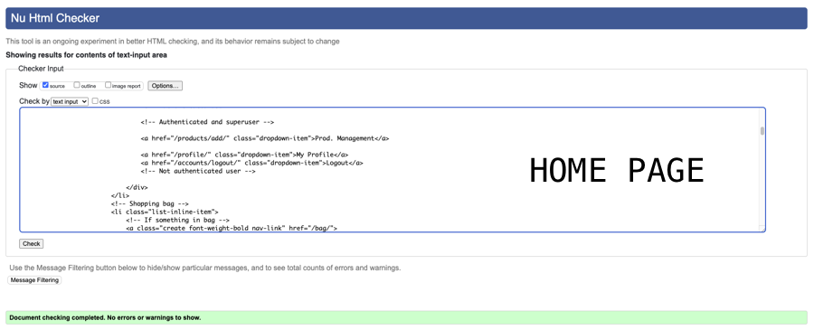
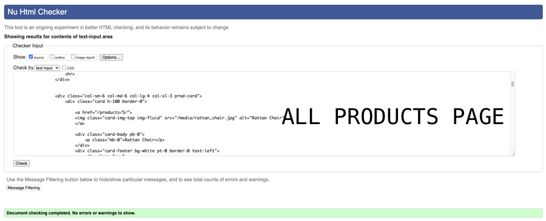
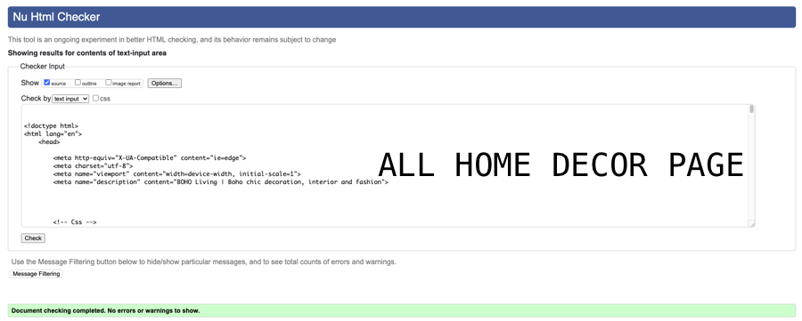
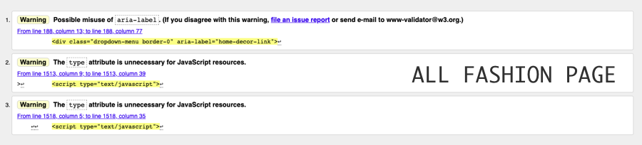
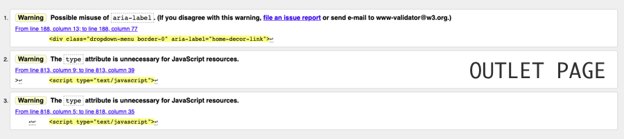
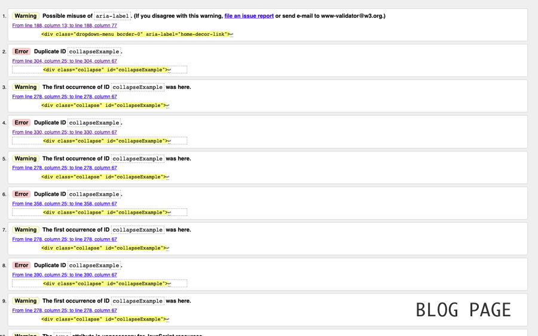
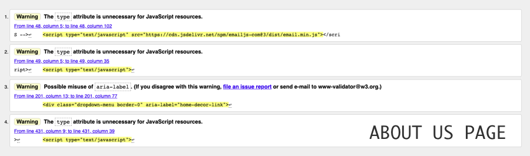

* CSS code is validated through [W3C Validator CSS](https://jigsaw.w3.org/css-validator/)

<b>RESULTS</b>

- __CSS__

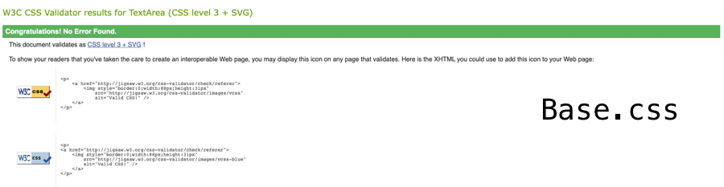

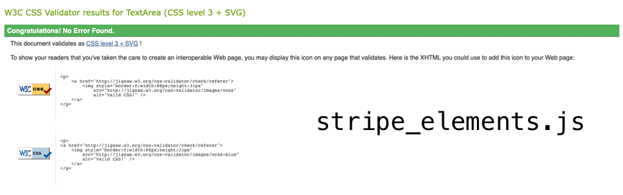

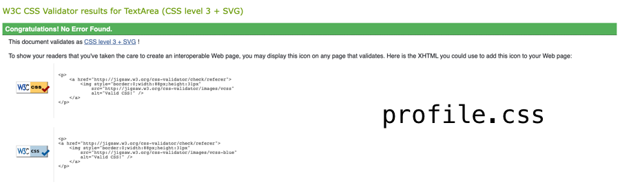

* JavaScript code is validated through [JSHint](https://jshint.com/)

<b>RESULTS</b>

- __JS__

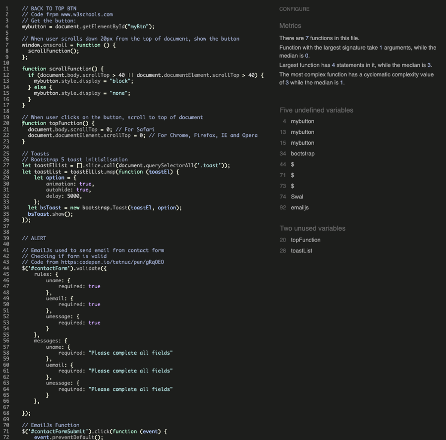

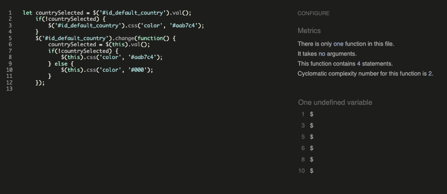

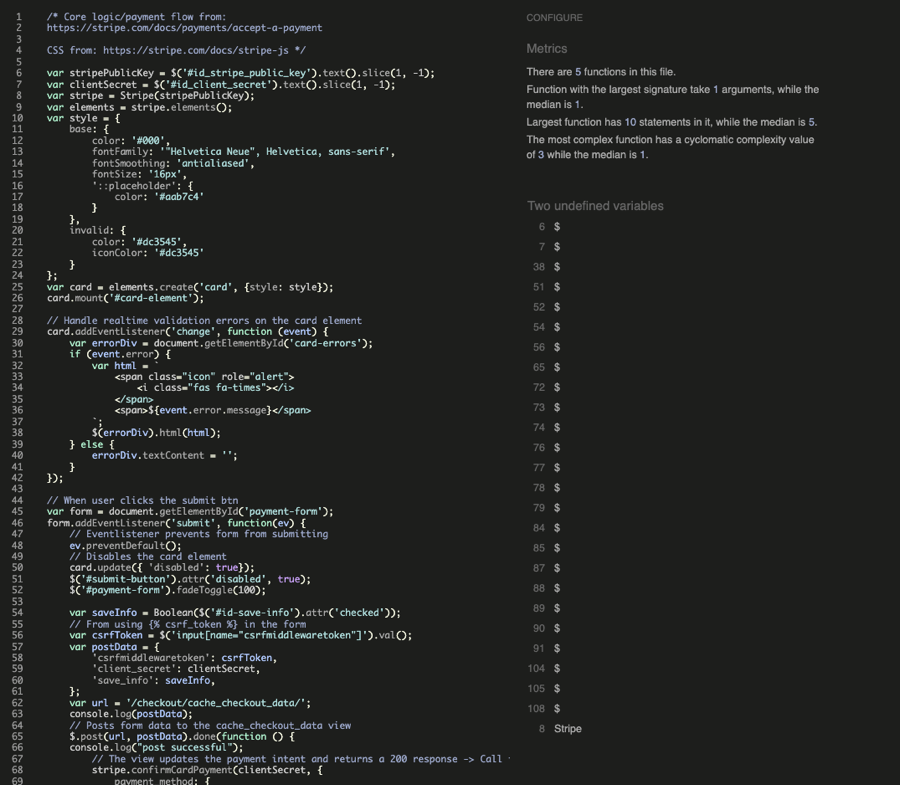

* Python code is validated through [PEP8](https://www.python.org/dev/peps/pep-0008/)

- __Python__

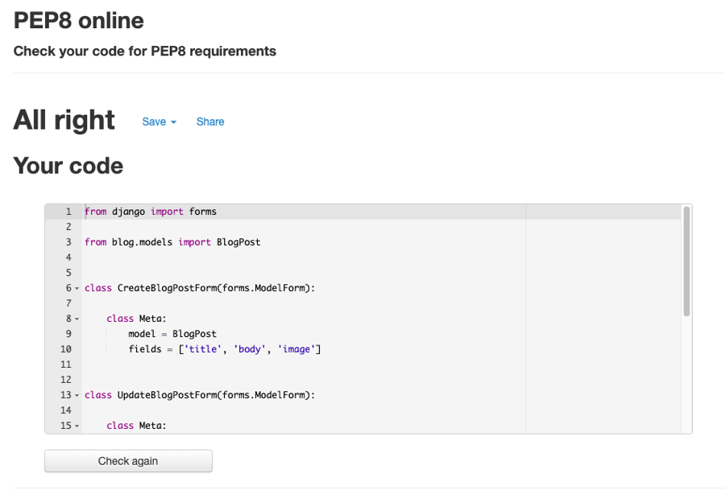
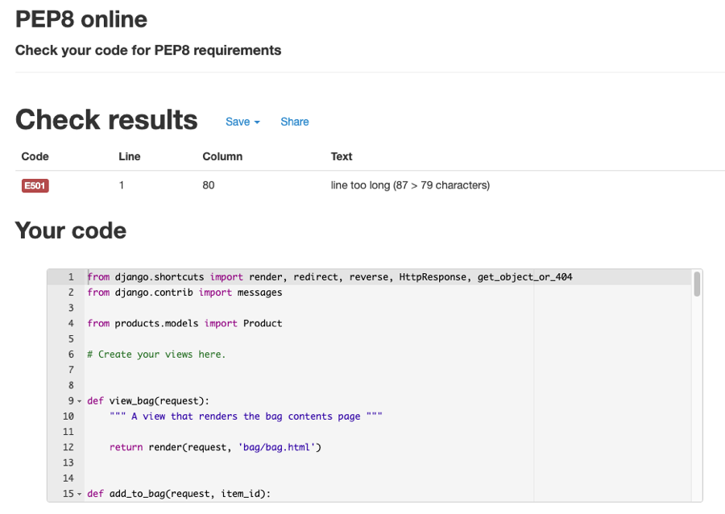
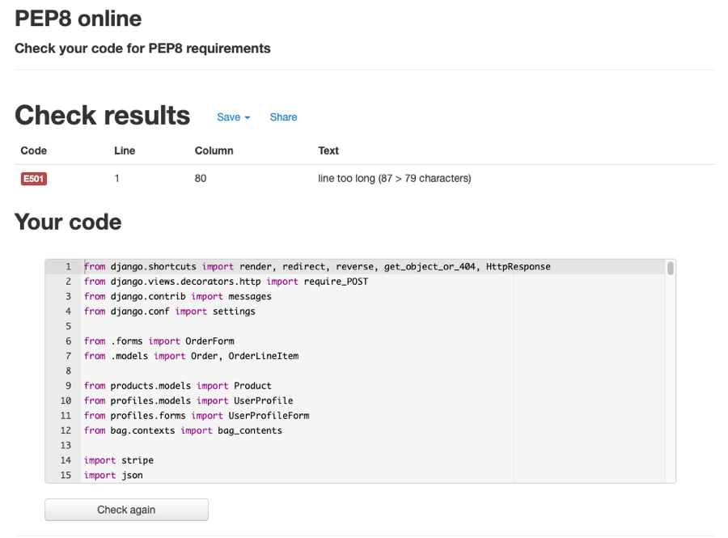

 

## Google Lighthouse Testing

All pages passed through Lighthouse in Chrome DevTools:

### Home page

  
Click to see results

  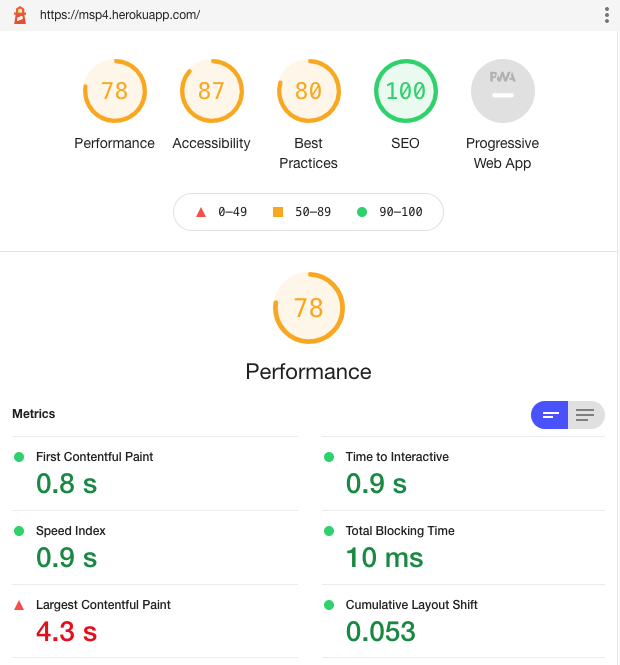

### All products page

  
Click to see results

  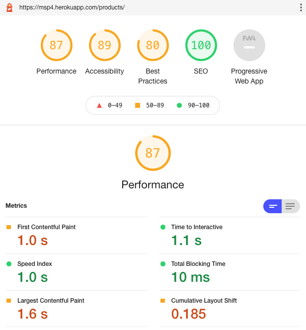

### All home decor page

  
Click to see results

  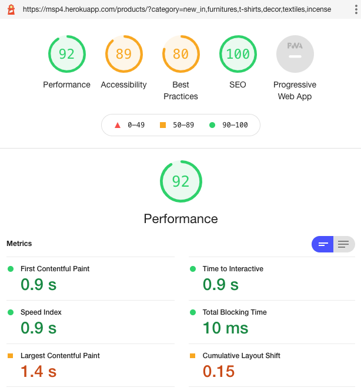

### All fashion page

  
Click to see results

  

### Outlet page

  
Click to see results

  

### Blog page

  
Click to see results

  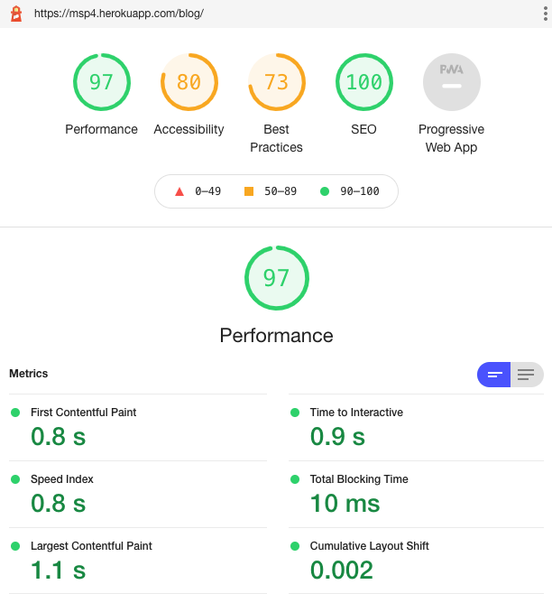

### About us page

  
Click to see results

  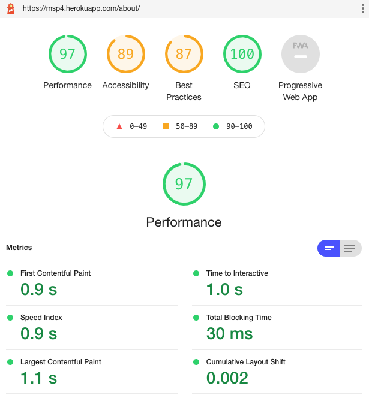

### Sign up page

  
Click to see results

  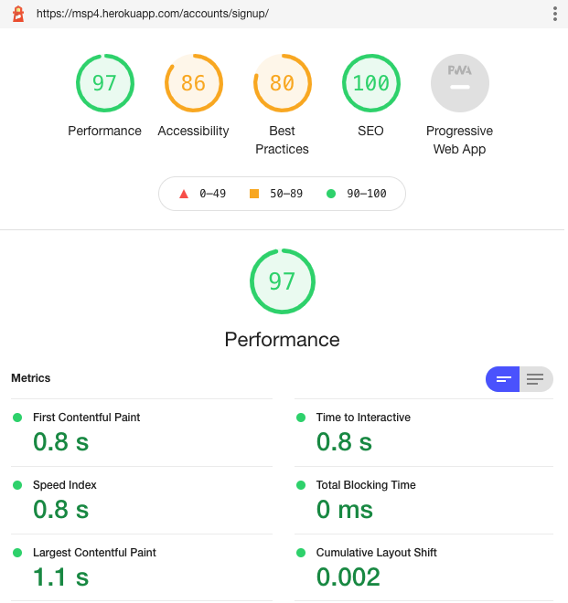

### Sign in page

  
Click to see results

  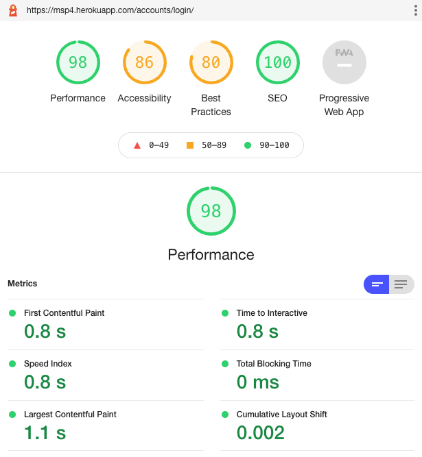

### Product detail page

  
Click to see results

  

### Bag page

  
Click to see results

  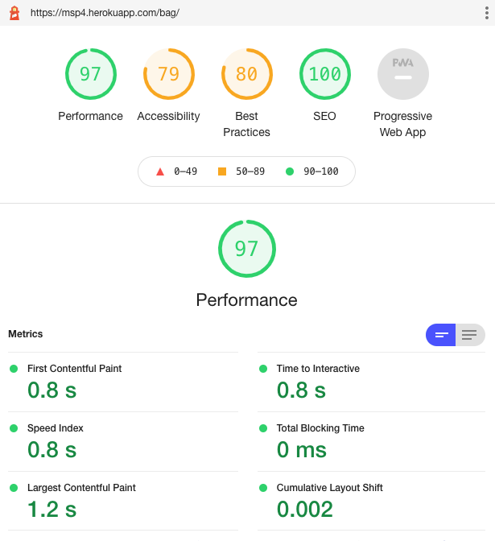

### Checkout page

  
Click to see results

  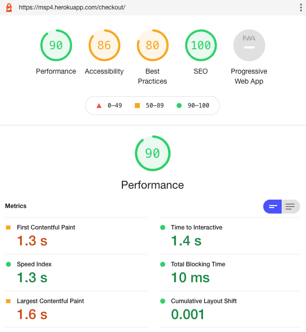

 

## Manual Testing

## Functionality Testing

re 

# Debugging 

## Issues and Bugs

 

* **Known bug:** On some iOS devices, this happens; Nothing happens when clicking "Register" or "Login" (if I am not signed in) after added item(s) in the bag (=toast). After signed in, nothing happens when clicking my profile or log out either. I need to refresh the page to be able to. Then it works as expected.   

* Some responsive design didn't work as expected, since the project use Bootstrap 5.1 I had to add "-bs-" in "data-toggle", "data-target", "data-autohide". 

* Toast messages didn't show as expected needed to change the JavaScript from: $('toast').toast('show') to $('.toast').show() to make the toast show as expected.

* When register new user at "My Account" an SMTPAuthenticationError at /accounts/signup/ occurred and text showed; "Already have an account? Then please sign in". I had "DEVELOPMENT" in my Gitpod settings, but scope was set for my old milestone project, not to this one (or */* (to access all)). It was trying to use the gmail smtp from Gitpod but gmail was expecting the Heroku app to access it, so it wasn't authenticated and thats why it didn't work. So after changed it to access all (*/*) it worked as expected. 

* No confirmation mail (to the terminal) was sent after making a "payment", just an 404 error in the terminal. I edited webhook endpoint in Stripe and then got an 200 error in terminal and a "payment_intent.succeeded" in Stripe, but no confirmation mail still. The problem was that the webhook itself wasn't set up quite right, I needed to add "8000-" in the beginning of my webhook and added checkout/wh/ in the end. I also had STRIPE_WH_KEY instead of STRIPE_WH_SECRET in Gitpod Environment Variables. When chaged those two things confirmation mail worked as expected. 

* 
Line too long in checkout/models.py.

